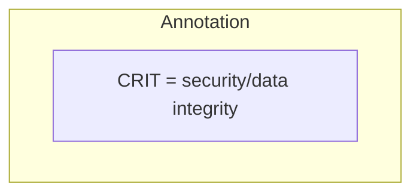
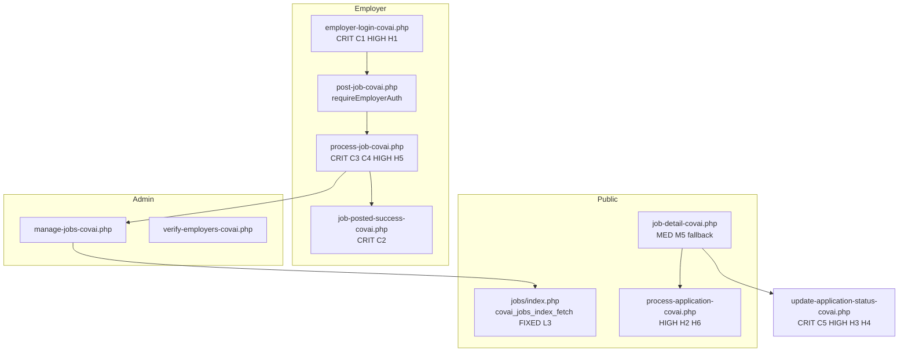

# Job posting visual map — critical audit and doc update

## Audit summary

The doc’s **§13 analyst review is directionally correct** for auth, success-page exposure, CSRF gaps, terms, and job-type mismatch. Code review found **additional critical issues not on diagrams**, **one wrong file path**, and **one outdated performance note** (listing SQL was fixed in a recent pass).

### Verified critical / high issues (must highlight on nodes)

| ID     | Severity | Finding                                                                                                            | Primary evidence                                                                                                                                                     |
| ------ | -------- | ------------------------------------------------------------------------------------------------------------------ | -------------------------------------------------------------------------------------------------------------------------------------------------------------------- |
| **C1** | Critical | Email-only employer login; no proof of ownership                                                                   | [`jobs/includes/employer-auth.php`](jobs/includes/employer-auth.php) `employerLogin()`                                                                               |
| **C2** | Critical | Success page loads any job by `?id=` without session/ownership                                                     | [`jobs/job-posted-success-covai.php`](jobs/job-posted-success-covai.php) lines 14–24                                                                                 |
| **C3** | Critical | New post resolves `employer_id` by **form email**, not session — can attach job to wrong employer                  | [`jobs/process-job-covai.php`](jobs/process-job-covai.php) lines 162–172 vs session at 100                                                                           |
| **C4** | Critical | **`process-job-covai.php` has no `requireEmployerAuth()`** — only CSRF; processor trusts POST email path           | [`jobs/process-job-covai.php`](jobs/process-job-covai.php) (no auth include) vs [`jobs/post-job-covai.php`](jobs/post-job-covai.php) line 14                         |
| **C5** | Critical | **SQL injection** on application status update (concatenated `$status`)                                            | [`jobs/update-application-status-covai.php`](jobs/update-application-status-covai.php) lines 25–33                                                                   |
| **H1** | High     | **Open redirect** — raw `redirect` GET/POST used in `header('Location: …')`                                        | [`jobs/employer-login-covai.php`](jobs/employer-login-covai.php) lines 10–17; same pattern in [`jobs/employer-register-covai.php`](jobs/employer-register-covai.php) |
| **H2** | High     | No CSRF on apply POST                                                                                              | [`jobs/process-application-covai.php`](jobs/process-application-covai.php) (no token check)                                                                          |
| **H3** | High     | No CSRF on application status POST                                                                                 | [`jobs/update-application-status-covai.php`](jobs/update-application-status-covai.php)                                                                               |
| **H4** | High     | Arbitrary `status` string on applications                                                                          | Same file, line 15                                                                                                                                                   |
| **H5** | High     | Terms checkbox not validated server-side                                                                           | [`jobs/post-job-covai.php`](jobs/post-job-covai.php) `name="terms"` vs no `terms` in [`jobs/process-job-covai.php`](jobs/process-job-covai.php)                      |
| **H6** | High     | `applicant_email` cookie 30 days, path `/`                                                                         | [`jobs/process-application-covai.php`](jobs/process-application-covai.php) ~line 121                                                                                 |
| **M1** | Medium   | `job_form_errors` / `job_form_data` stored on failure but **never read** in `post-job-covai.php`                   | [`jobs/process-job-covai.php`](jobs/process-job-covai.php) 260–265                                                                                                   |
| **M2** | Medium   | Job type filter mismatch: index `full-time` vs form `Full-time`                                                    | [`jobs/index.php`](jobs/index.php) vs [`jobs/post-job-covai.php`](jobs/post-job-covai.php)                                                                           |
| **M4** | Medium   | Legacy listing form is **`listings/post-job-omr.php`** (OMR copy), posts to missing `listings/process-listing.php` | [`listings/post-job-omr.php`](listings/post-job-omr.php) — doc incorrectly cites `post-job-covai.php`                                                                |
| **M5** | Medium   | Job detail **fallback** shows non-approved jobs                                                                    | [`jobs/job-detail-covai.php`](jobs/job-detail-covai.php) lines 71–82                                                                                                 |
| **M6** | Medium   | Employer account moderation is a **separate** admin path                                                           | [`jobs/admin/verify-employers-covai.php`](jobs/admin/verify-employers-covai.php) (not on context diagram)                                                            |

### Resolved / doc corrections

| Item                             | Action in doc                                                                                                                                       |
| -------------------------------- | --------------------------------------------------------------------------------------------------------------------------------------------------- |
| **L3** (load all jobs in memory) | Mark **FIXED (v4)** — public index uses [`covai_jobs_index_fetch()`](jobs/includes/job-functions-covai.php) from [`jobs/index.php`](jobs/index.php) |
| **M4 path**                      | Replace `listings/post-job-covai.php` with `listings/post-job-omr.php`                                                                              |
| **§13 H3 typo**                  | Fix stray `*` in `update-application-status-covai.php*`                                                                                             |
| **State: Closed**                | Note **unverified / likely unimplemented** in UI (no `status=closed` writers found in `jobs/`)                                                      |

### Missing from file map / diagrams (add)

- [`jobs/application-submitted-covai.php`](jobs/application-submitted-covai.php) — post-apply confirmation
- [`jobs/employer-landing-covai.php`](jobs/employer-landing-covai.php) — employer marketing entry
- [`jobs/edit-employer-profile-covai.php`](jobs/edit-employer-profile-covai.php)
- [`jobs/admin/index.php`](jobs/admin/index.php) — admin hub
- [`jobs/admin/verify-employers-covai.php`](jobs/admin/verify-employers-covai.php) — employer `pending` / `verified` / `suspended`
- [`jobs/admin/view-all-applications-covai.php`](jobs/admin/view-all-apuments-covai.php) — fix typo if present in doc
- [`jobs/generate-sitemap.php`](jobs/generate-sitemap.php) + [`.htaccess`](.htaccess) clean URLs `/jobs/{slug}-{id}` → `job-detail-covai.php`
- [`core/mycovai-config.php`](core/mycovai-config.php) — branding (MyCovai, not MyOMR)

---

## Documentation update approach

Target file: **[docs/inbox/JOB-POSTING-SYSTEM-END-TO-END-VISUAL-MAP.md](docs/inbox/JOB-POSTING-SYSTEM-END-TO-END-VISUAL-MAP.md)** only (no PHP fixes in this task unless you ask separately).

### 1. Add legend and annotation convention (new subsection after Purpose)

- Define tags: `[CRIT Cn]`, `[HIGH Hn]`, `[MED Mn]`, `[FIXED]`
- Reuse **classDef** pattern from §10 (`critical`, `high`, `medium`, `fixed`) on all flow diagrams
- Add **Risk legend** table mapping ID → one-line impact

### 2. Expand §10 Risk hotspot diagram

Add nodes (with `:::critical` / `:::high`):

- C3, C4, C5, H2, H3, H4, H5, H6, M1, M2, M5
- Link C4 → C3 (processor + email lookup)
- Link C5 → M3 (SQL style)

### 3. Annotate existing mermaid diagrams (inline + classes)

Apply tags on **specific nodes** only (avoid clutter on every box):

**§2 High-level context** — tag:

- Login/register: `[CRIT C1][HIGH H1]`
- Process job: `[CRIT C3][CRIT C4]`
- Success page: `[CRIT C2]`
- Job detail → apply: `[HIGH H2][MED M5]`
- Status update path (add small node): `[CRIT C5][HIGH H3][HIGH H4]`
- Add branch: `verify-employers-covai.php` under admin
- Public listing: note `[FIXED L3]` SQL pagination via `covai_jobs_index_fetch`

**§3 Employer journey** — tag S4/S5 (C1), S8 (C3/C4), S13 (C2), S15 unchanged; add optional path S3b Register → same risks as login (H1)

**§4 Sequence** — annotate Success participant (C2), Proc new-job path (C3/C4), add note on Apply without CSRF (H2)

**§5 State machine** — annotate `Closed` as “unverified”; `Rejected → Pending` cite edit flow

**§8 Auth map** — tag open redirect on login + register (H1); add `employer-register-covai.php`

**§9 Admin** — split **job moderation** vs **employer verification**; second subgraph for `verify-employers-covai.php`

**§11 Navigation** — add `application-submitted-covai.php`, `employer-landing-covai.php`, `employer-dashboard-covai.php`; note clean URL pattern from `getJobDetailUrl()` + `.htaccess`

**§6 ER** — add optional fields: `applications_count` on `job_postings`, `resume`/file fields on `job_applications` if present in DB (verify via schema doc or quick column grep during edit)

### 4. Revise §13 tables

- Add rows **C4**, **C5**
- Extend **H1** to include `employer-register-covai.php`
- Fix **M4** path and description (`post-job-omr.php`, OMR legacy)
- Update **L3** to **Resolved** with pointer to `covai_jobs_index_fetch`
- Add **§13.10** “Diagram ↔ finding index” (which section/node shows which ID)

### 5. Update §12 node inventory

- Add nodes: employer verification admin, application confirmation, sitemap/SEO URLs
- Tie security hardening row to C4, C5, H1–H4 explicitly

### 6. Revision log

- **v4**: Critical audit pass; diagram node annotations; C4/C5 added; L3 marked fixed; M4 path corrected; employer-verify + clean URLs in maps

---

## Architecture snapshot (for updated §2)

---

## Out of scope (call out in doc footer)

- **No code fixes** in this task — doc remains the blueprint; remediation order in §13.8 stays valid with C4/C5 inserted at top
- Legacy **OMR job landing pages** at repo root (`jobs-in-*-omr.php`) — optional footnote only
- **`getJobListings()`** still has in-memory paths — note as residual risk in `job-functions-covai.php`, not `index.php`

## Deliverable

Single updated markdown file with consistent risk IDs across §10, §13, diagram nodes, and traceability matrix — suitable as source-of-truth for the next security/UX sprint.
