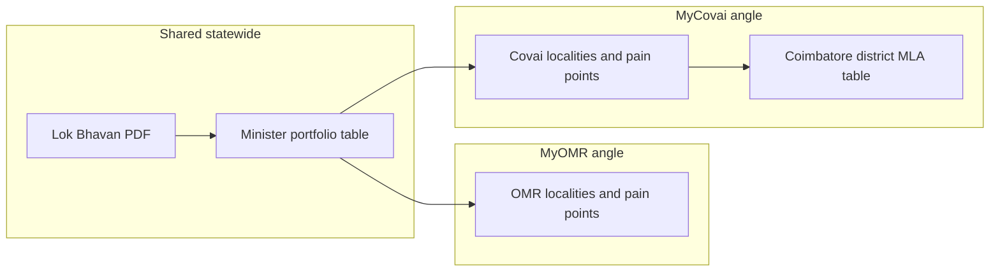

# MyCovai: Cabinet Article Adaptation & MLA Ideas

## Key distinction (do not mix these up)

| Layer                   | Who                                   | Scope                               | Same on both sites?                              |
| ----------------------- | ------------------------------------- | ----------------------------------- | ------------------------------------------------ |
| **Cabinet / ministers** | CM + Council of Ministers             | Whole Tamil Nadu                    | **Yes** — same Lok Bhavan PDF and portfolio list |
| **MLAs**                | Elected Assembly members              | One AC each (e.g. Coimbatore North) | **No** — Covai-specific list by constituency     |
| **City corporation**    | Coimbatore City Municipal Corporation | Urban Covai wards                   | Local angle only (not in cabinet PDF)            |

Readers care about **both**: who runs which _department_ statewide, and who represents _their AC_ in the Assembly. Your article should lead with ministers (state executive), then add MLAs as a second “who represents Covai” block.



---

## How to “use the same article” on mycovai.in

**Do not copy the MyOMR row verbatim** (duplicate content hurts SEO). Reuse:

- **Facts**: minister names, designations, portfolios (from [Lok Bhavan Press Release No. 38 PDF](https://mychennaicity.in/documents/tamil-nadu-cabinet-portfolios-may-2026/lok-bhavan-press-release-no-38-16-05-2026.pdf))
- **HTML/CSS pattern**: the `cabinet-feature` block from [dev-tools/sql/run-tamil-nadu-cabinet-portfolios-chennai-omr-article-16-may-2026.php](dev-tools/sql/run-tamil-nadu-cabinet-portfolios-chennai-omr-article-16-may-2026.php) (table at top, minister cards, OMR-angle callouts)

**Must change for MyCovai**:

| Field              | MyOMR (current)                                              | MyCovai (suggested)                                                                                                                                       |
| ------------------ | ------------------------------------------------------------ | --------------------------------------------------------------------------------------------------------------------------------------------------------- |
| **Title**          | …Matter for Chennai and OMR                                  | …Matter for **Coimbatore and Covai**                                                                                                                      |
| **Slug**           | `tamil-nadu-cabinet-portfolios-announced-chennai-omr-impact` | `tamil-nadu-cabinet-portfolios-announced-coimbatore-covai-impact`                                                                                         |
| **Summary / tags** | OMR, Sholinganallur, Perungudi…                              | Coimbatore, Covai, Peelamedu, RS Puram, Singanallur, Avinashi Road…                                                                                       |
| **Author**         | MyOMR Editorial Team                                         | MyCovai Editorial Team                                                                                                                                    |
| **Canonical**      | `https://myomr.in/local-news/...`                            | `https://mycovai.in/local-news/...`                                                                                                                       |
| **Body**           | All “OMR angle” boxes                                        | **“Covai angle”** boxes with Coimbatore examples                                                                                                          |
| **Cross-link**     | Optional                                                     | One line: “Chennai/OMR readership: see [sister article on MyOMR](https://myomr.in/local-news/tamil-nadu-cabinet-portfolios-announced-chennai-omr-impact)” |

**Encoding rule** (fixes `â€"` on live pages): use only HTML entities in HTML — `—`, `–`, `’` — never raw UTF-8 em dashes in SQL/PHP if the pipeline ever re-saves as Windows-1252.

---

## Recommended article architecture (content order)

Hand this structure to the mycovai Cursor instance when inserting into `articles`:

1. **Hero** — “Chennai & Covai · State governance · 16 May 2026” (or Covai-only eyebrow)
2. **Lead + dateline** — same statewide event; cite Press Release No. 38
3. **Official source box** — PDF download (same URL as MyOMR)
4. **Full cabinet table (top)** — identical minister list; jump links to profiles below
5. **Quick-jump chips** — CM, PWD, Finance, Industries, Health, etc.
6. **One short Covai intro** — why portfolios matter here (not OMR IT corridor language)
7. **Department pills** — same tags; optional add “Textiles / MSME” if you stress Covai industry
8. **Minister profile cards** — same 10 ministers; each ends with **Covai angle** (see mapping below)
9. **NEW: Coimbatore MLAs at a glance** — table + link to `/elections-2026/` constituency pages (if subsite exists)
10. **Why this matters for Covai** — 6-card grid (localised labels)
11. **What Covai residents should track** — checklist (localised)
12. **MyCovai View** — editorial summary
13. **Sources** — PDF + image credit + DT Next / ToI; no mojibake

---

## Covai angle copy (replace OMR examples)

Use the same minister cards; swap only the local paragraph and callout:

| Minister / portfolio                   | Covai-relevant hook                                                                                     |
| -------------------------------------- | ------------------------------------------------------------------------------------------------------- |
| **CM — Municipal Admin & Urban Water** | Coimbatore Corporation water, UGD/stormwater, ward grievances, tanker dependency in expanding suburbs   |
| **Aadhav — PWD & Highways**            | Avinashi Road, Mettupalayam Road, NH-544 choke points, flyover/junction works, industrial estate access |
| **Sengottaiyan — Finance**             | Budget for Smart City leftovers, bus stands, lake restoration, district hospital upgrades               |
| **Keerthana — Industries**             | Textiles, foundry, pump/motor belt, TIDEL / IT parks on Saravanampatti–Kalapatti axis, MSME employment  |
| **Rajmohan — School Education**        | Corporation + matric school density; TNPSC/coaching hub angle optional                                  |
| **Dr. Arunraj — Health**               | CMCH, PSG, KMCH pressure; peri-urban PHCs in Sulur / Kinathukadavu growth                               |
| **Nirmalkumar — Energy**               | Load shedding in Peelamedu/Singanallur; industrial power tariffs; solar on rooftops                     |
| **N. Anand — Rural & Water**           | Peri-urban tanks, Siruvani/water stress narratives, Panchayat belts outside corporation                 |
| **Venkataramanan — Food supplies**     | Ration shops, hostel/worker populations, price control in markets                                       |
| **Dr. Prabhu — Mines**                 | Sand/quarry regulation affecting construction across Covai district                                     |

**Locality name bank** (sprinkle in intro/pills): RS Puram, Gandhipuram, Peelamedu, Singanallur, Saravanampatti, Kalapatti, Kuniyamuthur, Town Hall, Race Course, Ukkadam, Saibaba Colony, Thudiyalur, Vadavalli, Mettupalayam (city fringe).

---

## Can you list MLAs? Yes — as a separate section

**Cabinet ministers ≠ MLAs.** After the 2026 election, Coimbatore district has multiple Assembly constituencies; each has one **MLA**. None of that is in the Lok Bhavan cabinet PDF — you source it from election results / your elections subsite.

### Suggested MLA block (place after minister cards, before “Why this matters”)

**Heading:** `Coimbatore district MLAs (Assembly 2026)`

**Table columns:** AC name · AC no. · MLA name · Party · Link

**Constituencies to include** (verify names/numbers against [TN CEO / ECI](https://www.elections.tn.gov.in); typical Coimbatore district set):

- Coimbatore North, South, East, West
- Mettupalayam
- Sulur
- Kinathukadavu
- Pollachi
- Valparai
- (Add/remove per your district boundary editorial choice)

**Data source options:**

1. **Best:** `elections-2026/includes/constituency-data.php` on mycovai (pattern in [elections-2026/includes/constituency-data.php](elections-2026/includes/constituency-data.php) on MyOMR) — single source of truth; article PHP or static HTML reads the array.
2. **Manual table** in article HTML after results are final — fine for a one-off publish script.
3. **Post-results update** — link “Results 2026” page when [docs/ELECTION-PLAN-FOR-MYCOVAI-REPLICATION.md](docs/ELECTION-PLAN-FOR-MYCOVAI-REPLICATION.md) `results-2026.php` is live.

**Disclaimer line:** “MLAs represent assembly constituencies; cabinet ministers hold state departments. An MLA may or may not be a minister.”

---

## Design handoff (for mycovai Cursor)

Reuse the **cabinet-feature** scoped CSS from the MyOMR publish script with these tweaks for MyCovai branding:

- Rename wrapper to `covai-cabinet-feature` (optional) to avoid clashes
- Shift accent from MyOMR green to **MyCovai palette** (your site primary — e.g. teal/orange if that is Covai brand)
- Keep: table-first layout, CM row highlight, 2-column minister cards, tagged “Covai angle” callouts, jump nav
- **Typography:** force `Poppins` on all in-article `h2`/`h3` with `!important` so site-wide Playfair does not fight card titles
- **Mobile:** horizontal scroll on MLA + cabinet tables; single-column cards below 640px

Hero image: same Secretariat photo + News9Live credit is fine statewide; or use a Coimbatore landmark (CODISSIA, Town Hall, Siruvani) if you have rights.

---

## SEO & metadata (MyCovai)

```
Title: Tamil Nadu Cabinet Portfolios Announced: What It Means for Coimbatore and Covai Residents
Slug: tamil-nadu-cabinet-portfolios-announced-coimbatore-covai-impact
Meta: Tamil Nadu CM C. Joseph Vijay has allocated ministerial portfolios. What Municipal Administration, PWD, Industries, Health and Finance mean for Coimbatore, Covai, Peelamedu and the district.
Tags: Tamil Nadu Cabinet, Coimbatore, Covai, C. Joseph Vijay, MLA, Municipal Administration, Avinashi Road, Industries, CMCH, Lok Bhavan
```

Optional **FAQ schema** (2–3 questions): “Who is the CM?”, “Which minister handles highways for Covai?”, “How is an MLA different from a minister?”

---

## Extra content ideas (beyond one article)

1. **Tamil sibling** — `…-covai-impact-tamil` (same structure as MyOMR Tamil news pattern).
2. **Constituency deep-dives** — link each MLA row to `/elections-2026/constituency/coimbatore-north.php` etc.
3. **“Who to contact for…”** — ward corporator vs MLA vs minister (simple decision tree).
4. **Corporation watch** — follow-up when CM holds Municipal Admin: “What Coimbatore Corporation should push for.”
5. **Industry brief** — Keerthana portfolio + Covai textile/MSME (spin-off article).
6. **Cross-promotion** — MyOMR ad slot already points to MyCovai; reciprocal link in Covai article footer.
7. **MP layer (optional)** — Coimbatore/Pollachi Lok Sabha MPs are a third table; only if you want parliamentary contact info.

---

## What to paste into the mycovai Cursor instance

1. This plan (sections + Covai angle table + MLA table spec).
2. Full HTML body from [run-tamil-nadu-cabinet-portfolios-chennai-omr-article-16-may-2026.php](dev-tools/sql/run-tamil-nadu-cabinet-portfolios-chennai-omr-article-16-may-2026.php) — find/replace: `OMR` → `Covai`, locality lists, slug/title/meta, add MLA section.
3. Link to [docs/ELECTION-PLAN-FOR-MYCOVAI-REPLICATION.md](docs/ELECTION-PLAN-FOR-MYCOVAI-REPLICATION.md) for long-term MLA data.
4. Instruction: publish via mycovai `articles` insert script or `/admin/articles/add.php`; use `—` only for dashes.

No code changes required in **this** MyOMR repo unless you want a parallel `run-tamil-nadu-cabinet-portfolios-coimbatore-covai-article-16-may-2026.php` kept here as a content template for git history.
