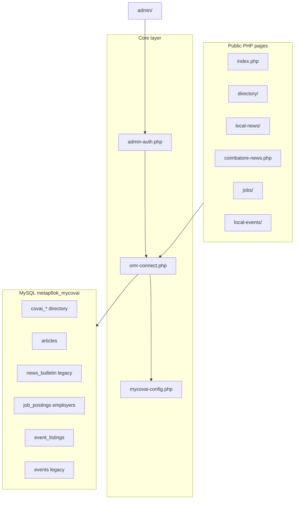
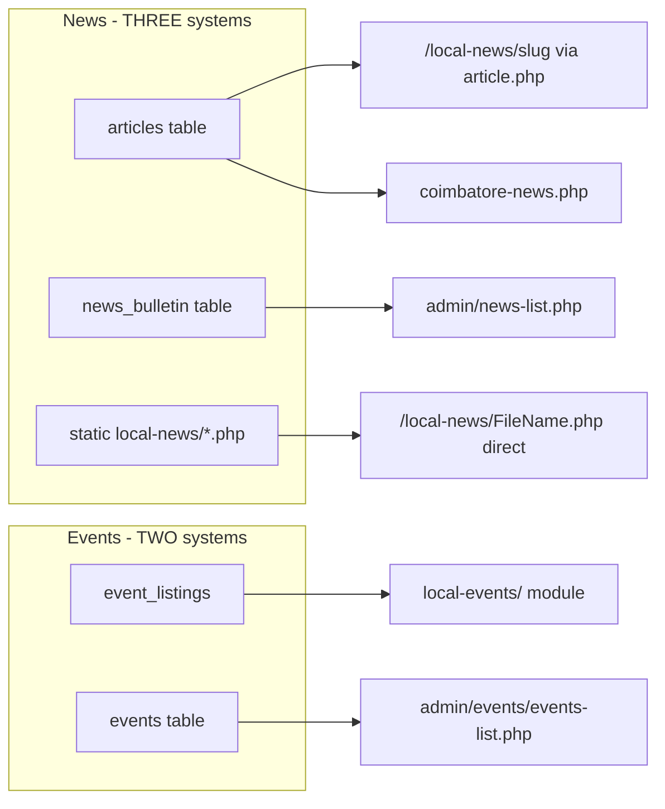
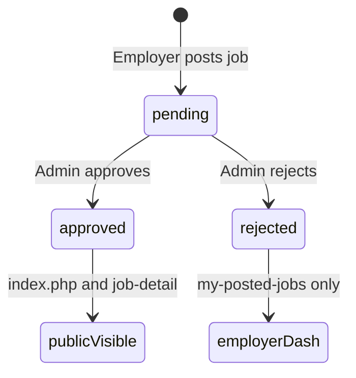
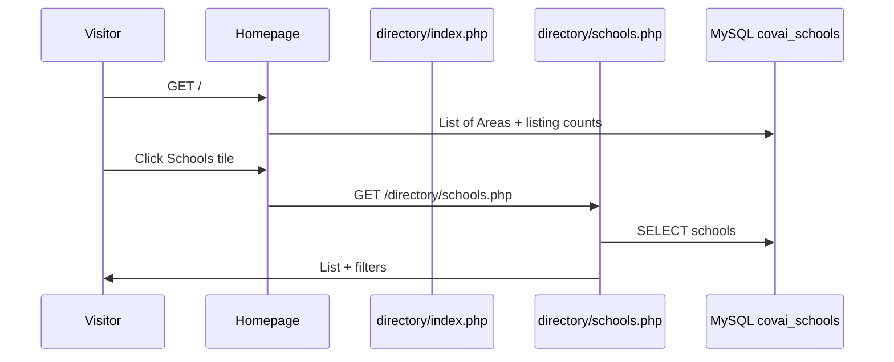
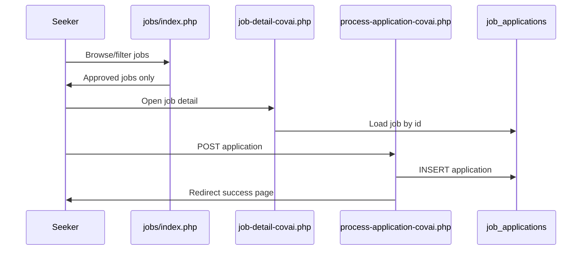
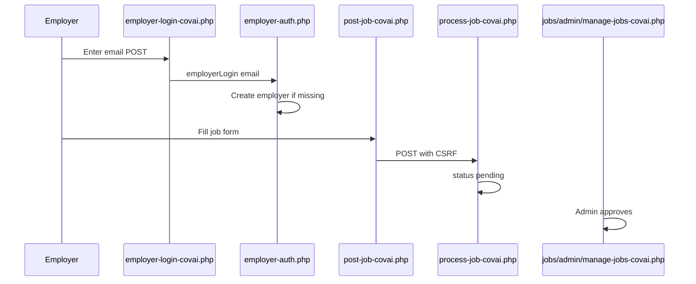

# MyCovai.in — Comprehensive Pre-Change Audit

**Scope:** Read-only review of repo at `e:\OneDrive\_mycovai\_mycovai_Root` (native PHP, MySQLi, includes, cPanel shared hosting). No files were modified.

**Stack confirmed:** PHP 8.2 (`ea-php82` in [`.htaccess`](.htaccess)), MySQL via [`core/omr-connect.php`](core/omr-connect.php), modular folders under document root, no Composer framework.

**Audit layers covered:**

1. Security, hosting, database, code quality (sections 1–12)
2. **Content-level audit** — branding, geography, duplicate systems (section 13)
3. **Sections, categories & IA** — navigation registry vs public UX (section 14)
4. **Logic audit** — business rules, state machines, edge cases (section 15)
5. **End-to-end user flow audits** — visitor, employer, admin journeys (section 16)
6. **Project plan ideas** — phased product/tech roadmap (section 17)
7. Priority fixes, exact instructions, testing, handover (sections 18–22)

---

## 1. Project Understanding

**Purpose:** **MyCovai** (rebrand from MyOMR) is a **Coimbatore local community portal**: business/civic **directory**, **local news/articles**, **job board**, **events**, **hostels/PGs**, **coworking**, election microsite, and legacy OMR-era pages still in tree.

**Primary audiences:**

- Public: browse listings, read news, apply for jobs, post events/listings (moderated).
- Employers / property owners / coworking owners: lightweight dashboards (email-based login).
- Staff: `/admin/` CMS + module admins (`jobs/admin/`, `local-events/admin/`, etc.).

**Main entry points:**
| Entry | Role |
|-------|------|
| [`index.php`](index.php) | Homepage, category grid, DB-backed area list |
| [`directory/index.php`](directory/index.php) | Directory hub + search redirect |
| [`local-news/article.php`](local-news/article.php) | DB articles via `/local-news/{slug}` rewrite |
| [`coimbatore-news.php`](coimbatore-news.php) | Covai news landing (articles table) |
| [`jobs/index.php`](jobs/index.php) | Job listings; pretty URLs `/jobs/{slug}-{id}` |
| [`local-events/*`](local-events/) | Events module (public) |
| [`admin/index.php`](admin/index.php) | Admin dashboard (uses `_bootstrap` + `requireAdmin`) |
| [`weblog/generate-sitemap-index.php`](weblog/generate-sitemap-index.php) | Root sitemap (via rewrite) |

**Include pattern:** Pages `require_once` [`core/omr-connect.php`](core/omr-connect.php) → [`core/mycovai-config.php`](core/mycovai-config.php); public UI uses [`components/homepage-header.php`](components/homepage-header.php) **or** [`components/main-nav.php`](components/main-nav.php), [`components/analytics.php`](components/analytics.php); admin newer pages use [`admin/_bootstrap.php`](admin/_bootstrap.php) + [`admin/layout/header.php`](admin/layout/header.php).

---

## 2. Folder Structure Audit

| Area           | Location                                                                                                                    | Assessment                                                                     |
| -------------- | --------------------------------------------------------------------------------------------------------------------------- | ------------------------------------------------------------------------------ |
| Public pages   | Root + `directory/`, `local-news/`, `jobs/`, etc.                                                                           | Mixed: many legacy `*-omr.php` names; rewrites to `*-covai.php` in `.htaccess` |
| Admin          | [`admin/`](admin/)                                                                                                          | Present; **no** dedicated `.htaccess` (relies on `robots.txt` Disallow only)   |
| Includes       | [`core/`](core/), [`components/`](components/), module `includes/`                                                          | Reasonable                                                                     |
| Config         | [`core/mycovai-config.php`](core/mycovai-config.php), [`core/admin-config.php`](core/admin-config.php)                      | **Secrets in PHP files** — see security                                        |
| Assets         | [`assets/`](assets/), module `assets/`                                                                                      | OK                                                                             |
| Uploads        | `local-news/covai-news-images/`, `news_images/`, job posters                                                                | Partial hardening (`.htaccess` on news images)                                 |
| Logs           | [`logs/`](logs/) (via error-handler), `weblog/*.log`                                                                        | **Needs verification** writable on cPanel                                      |
| Dev/migrations | [`dev-tools/`](dev-tools/), [`database/`](database/)                                                                        | `dev-tools` has IP restrict `.htaccess`; **`database/` has no `.htaccess`**    |
| Legacy         | [`events/`](events/), [`listings/`](listings/), [`local-news/*.php`](local-news/) static articles, root `jobs-in-*-omr.php` | **Content + logic debt** — see sections 13–16                                  |
| Reusable UI    | [`components/`](components/)                                                                                                | **Two nav systems** — homepage-header vs main-nav                              |

**Exposed / sensitive paths (if under `public_html`):**

- [`core/omr-connect.php`](core/omr-connect.php), [`database/*.sql`](database/), [`admin/migrations-runner.php`](admin/migrations-runner.php), [`admin/updatenewsform.php`](admin/updatenewsform.php), [`events/db.php`](events/db.php), [`test-website/`](test-website/)

---

## 3. cPanel Hosting Compatibility

**Working well:** HTTPS + non-www, security headers, PHP 8.2 handler, `MYCOVAI_ENV production`, sitemap rewrites, static asset caching.

**Issues:**

| Issue                                                                                            | Severity           | Notes                            |
| ------------------------------------------------------------------------------------------------ | ------------------ | -------------------------------- |
| [`core/env.php`](core/env.php) `DEVELOPMENT_MODE` true default                                   | High               | Conflicts with production intent |
| [`index.php`](index.php), [`coimbatore-news.php`](coimbatore-news.php) `display_errors=1`        | High               | Public error leakage             |
| [`jobs/includes/error-reporting.php`](jobs/includes/error-reporting.php) `DEVELOPMENT_MODE true` | Critical           | Entire jobs module               |
| [`core/error-handler.php`](core/error-handler.php) not wired                                     | Medium             | No unified logging               |
| [`database/`](database/) no `.htaccess`                                                          | Critical           | SQL downloadable                 |
| `dev-tools/.htaccess`                                                                            | Needs verification | Test remote 403                  |

**Deployment assumption:** Full repo under `public_html`; ideal split (core outside webroot) not used.

---

## 4. Database Audit

**Connection:** MySQLi in [`core/omr-connect.php`](core/omr-connect.php); utf8mb4; env overrides for live CLI.

**Schema direction:**

- Directory: `covai_*` via [`COVAI_TABLES`](core/mycovai-config.php)
- Editorial: `articles` (primary, slug, draft/published)
- Legacy editorial: `news_bulletin` (still used by admin news-list)
- Jobs: `job_postings`, `employers`, `job_applications`, `job_categories`
- Events (live module): `event_listings`
- Events (legacy admin): `events` table — **parallel system**
- Property: `hostels_pgs`, `coworking_spaces`, `property_owners`

**Query safety:** Prepared statements dominant; weak spots in admin search concatenation, [`coimbatore-news.php`](coimbatore-news.php) tag filter LIKE concat, legacy scripts.

---

## 5. Security Audit

| Category                    | Finding                                      | Severity |
| --------------------------- | -------------------------------------------- | -------- |
| Credentials in repo         | `omr-connect.php`                            | Critical |
| Default admin password      | `admin-config.php` hashes `'password'`       | Critical |
| Employer/owner login        | Email-only session                           | Critical |
| CSRF GET delete             | `news-list.php`, `affiliate-links.php`, etc. | High     |
| Open redirect               | `admin/login.php` `?redirect=`               | High     |
| Legacy `updatenewsform.php` | No auth, SQLi                                | Critical |
| Migrations runner           | Web-accessible DDL                           | High     |
| Application CSRF            | `process-application-covai.php`              | Medium   |
| Stored XSS                  | `article.php` raw HTML body                  | Medium   |
| robots.txt gaps             | No `/database/`, `/jobs/admin/`              | Medium   |

**Positive:** Admin login CSRF + rate limit; job post CSRF; upload dir PHP block on news images.

---

## 6. PHP Code Quality Audit

- Dual admin auth patterns (`requireAdmin` vs manual session check)
- Dual nav components; Bootstrap 4/5 mix in admin
- `sanitize_input()` escapes before DB (wrong layer)
- Legacy folders coexist with Covai modules
- Branding drift throughout (MyOMR strings)

---

## 7. Admin Panel Audit

- Login protection present on sampled pages; inconsistent bootstrap
- RBAC `requireRole()` underused
- **Dual events admin:** [`admin/events/events-list.php`](admin/events/events-list.php) → `events` table vs [`local-events/admin/manage-events-covai.php`](local-events/admin/manage-events-covai.php) → `event_listings`
- **Dual news admin:** [`admin/articles/`](admin/articles/) vs [`admin/news-list.php`](admin/news-list.php)
- GET deletes without CSRF on several list pages
- Pagination inconsistent (`LIMIT 200` on manage-\* pages)

---

## 8. UI/UX Audit (summary)

- Homepage + directory hub: modern Covai copy
- Admin: fragmented sidebars, mixed Bootstrap
- Employer login UI implies email verification that does not exist
- Homepage header CTA "Add Listing" → jobs employer landing (not directory "get listed")
- Two nav experiences: [`homepage-header.php`](components/homepage-header.php) on homepage/directory vs [`main-nav.php`](components/main-nav.php) elsewhere

---

## 9. SEO Audit

- Good: canonical, sitemaps, article schema, hreflang for Tamil articles
- Gaps: OMR geo landing pages (`jobs-in-omr-chennai.php`, etc.) still linked from main-nav; hundreds of static `local-news/*.php` with OMR meta; duplicate `.htaccess` hospital/bank rules; logo filename `My-OMR-Logo.jpg`

---

## 10. Performance Audit

- Homepage listing counts query each category table on every load
- `best-schools` and `schools` share same table → duplicate count logic in [`homepage-listing-counts.php`](core/homepage-listing-counts.php)
- CDN render-blocking CSS/JS; admin tables unpaginated

---

## 11. Error Logging and Debugging

| Source                                               | Production-safe? |
| ---------------------------------------------------- | ---------------- |
| `index.php`, `coimbatore-news.php` display_errors ON | **No**           |
| `jobs/includes/error-reporting.php`                  | **No**           |
| `core/error-handler.php`                             | Not loaded       |
| `.htaccess` MYCOVAI_ENV                              | Signal only      |

---

## 12. File-by-File Review (critical files)

| File                                                                         | Role          | Issues                              | Severity | Fix                         |
| ---------------------------------------------------------------------------- | ------------- | ----------------------------------- | -------- | --------------------------- |
| [`core/omr-connect.php`](core/omr-connect.php)                               | DB            | Hardcoded creds                     | Critical | Env-only                    |
| [`core/admin-config.php`](core/admin-config.php)                             | Admin         | Default password                    | Critical | Precomputed hash in env     |
| [`jobs/includes/employer-auth.php`](jobs/includes/employer-auth.php)         | Auth          | No password                         | Critical | Magic link                  |
| [`hostels-pgs/includes/owner-auth.php`](hostels-pgs/includes/owner-auth.php) | Auth          | No password                         | Critical | Same                        |
| [`admin/news-list.php`](admin/news-list.php)                                 | Legacy news   | GET delete; wrong table vs articles | High     | Deprecate or align          |
| [`admin/events/events-list.php`](admin/events/events-list.php)               | Legacy events | Wrong table vs public module        | High     | Route to local-events admin |
| [`jobs/job-detail-covai.php`](jobs/job-detail-covai.php)                     | Job view      | Fallback shows non-approved jobs    | High     | Remove fallback             |
| [`components/main-nav.php`](components/main-nav.php)                         | Nav           | Links to OMR job landers            | Medium   | Point to `/jobs/`           |
| [`core/homepage-listing-counts.php`](core/homepage-listing-counts.php)       | Counts        | Legacy omr\_\* fallbacks            | Medium   | covai\_\* only              |
| [`database/`](database/)                                                     | SQL           | Web accessible                      | Critical | `.htaccess` deny            |

---

## 13. Content-Level Audit

### 13.1 Branding mismatches (MyOMR vs MyCovai)

| Location                                                                                       | Current content                  | Expected                   | Severity   |
| ---------------------------------------------------------------------------------------------- | -------------------------------- | -------------------------- | ---------- |
| [`admin/login.php`](admin/login.php) title                                                     | "MyOMR Admin Login"              | MyCovai Admin              | Medium     |
| [`admin/index.php`](admin/index.php) H1                                                        | "Manage the MyOMR Platform"      | MyCovai                    | Medium     |
| [`hostels-pgs/add-property.php`](hostels-pgs/add-property.php)                                 | "MyOMR Hostels", "OMR Chennai"   | MyCovai / Coimbatore       | High       |
| [`coworking-spaces/my-spaces.php`](coworking-spaces/my-spaces.php)                             | "MyOMR" in title                 | MyCovai                    | Medium     |
| [`local-news/news-highlights-from-omr-road.php`](local-news/news-highlights-from-omr-road.php) | "MyOMR News Bulletin"            | Covai News or redirect     | High       |
| [`core/mycovai-config.php`](core/mycovai-config.php) `SITE_LOGO_URL`                           | `/My-OMR-Logo.jpg`               | MyCovai logo asset         | Medium     |
| [`docs/data-backend/DATABASE_STRUCTURE.md`](docs/data-backend/DATABASE_STRUCTURE.md)           | `metap8ok_myomr`, omr\_\* tables | metap8ok*mycovai, covai*\* | Low (docs) |
| [`docs/operations-deployment/ONBOARDING.md`](docs/operations-deployment/ONBOARDING.md)         | "MyOMR.in" throughout            | MyCovai.in                 | Low (docs) |
| Admin approval emails (coworking-spaces admin)                                                 | "MyOMR Team"                     | MyCovai Team               | Medium     |

**Static legacy news files:** 100+ files under [`local-news/`](local-news/) (e.g. `New-Road-Side-Park-...php`) still contain OMR meta keywords ("Old Mahabalipuram Road", Perungudi, Sholinganallur). These are **Chennai/OMR content on a Coimbatore site** — SEO and trust risk if indexed.

### 13.2 Geography mismatches (OMR Chennai vs Coimbatore)

| Asset                                                                                          | Problem                                                                  |
| ---------------------------------------------------------------------------------------------- | ------------------------------------------------------------------------ |
| Root `jobs-in-*-omr.php`, `it-jobs-omr-chennai.php`                                            | OMR locality SEO pages; still in repo and linked                         |
| [`components/main-nav.php`](components/main-nav.php) line ~599                                 | "Find Jobs" dropdown links to `/jobs-in-omr-chennai.php` not `/jobs/`    |
| [`.htaccess`](.htaccess) line 210                                                              | `it-parks` rewrite → `directory/it-parks-in-omr.php` (filename says OMR) |
| [`listings/`](listings/), [`info/report-civic-issue-omr.php`](info/report-civic-issue-omr.php) | OMR-specific civic/listing flows                                         |
| [`events/`](events/) folder                                                                    | Legacy OMR events HTML/PHP                                               |
| Hostels/coworking copy (some pages)                                                            | Still "OMR Chennai" in descriptions                                      |

### 13.3 Duplicate content systems

| System A                                            | System B                                                           | Risk                                                                          |
| --------------------------------------------------- | ------------------------------------------------------------------ | ----------------------------------------------------------------------------- |
| `articles` + [`admin/articles/`](admin/articles/)   | `news_bulletin` + [`admin/news-list.php`](admin/news-list.php)     | Editors publish to wrong place; homepage cards vs bulletin diverge            |
| [`local-events/`](local-events/) + `event_listings` | [`admin/events/`](admin/events/) + `events` table                  | Admin nav "Events" points to **legacy** list; public site uses **new** module |
| DB articles via slug rewrite                        | Static PHP articles in same folder                                 | Duplicate URLs, conflicting canonicals, crawl budget waste                    |
| [`coimbatore-news.php`](coimbatore-news.php)        | [`local-news/news-highlights.php`](local-news/news-highlights.php) | Multiple "news home" entry points                                             |

### 13.4 Copy / UX content mismatches

| Element                                          | Says                                                                     | Does                                                                          | Fix idea                                                 |
| ------------------------------------------------ | ------------------------------------------------------------------------ | ----------------------------------------------------------------------------- | -------------------------------------------------------- |
| Homepage CTA "Add Listing"                       | Generic listing                                                          | Links to [`jobs/employer-landing-covai.php`](jobs/employer-landing-covai.php) | Rename CTA "Post a Job" or add directory get-listed link |
| Employer login help text                         | "We'll send notifications to this email"                                 | No email sent on login; instant session                                       | Align copy with magic-link or remove false implication   |
| [`index.php`](index.php) queries `List of Areas` | Area dropdown data                                                       | Table name legacy; may not match `SITE_AREAS` in config                       | Verify live table populated with Coimbatore areas        |
| Admin module descriptions                        | Accurate in [`admin/config/navigation.php`](admin/config/navigation.php) | Legacy pages don't match descriptions (events → wrong table)                  | Wire nav paths to canonical admin handlers               |

### 13.5 Content audit severity summary

| Issue                         | Severity | Phase                               |
| ----------------------------- | -------- | ----------------------------------- |
| OMR static news pages indexed | High     | 2 — noindex or 301 to article slugs |
| Dual news admin               | High     | 2 — deprecate news_bulletin         |
| Dual events admin             | High     | 2 — admin nav → local-events admin  |
| Nav links to OMR job landers  | High     | 2                                   |
| MyOMR strings in live modules | Medium   | 3–4                                 |
| Logo filename                 | Low      | 4                                   |

---

## 14. Sections, Categories & Information Architecture

### 14.1 Public category registry (single source)

Defined in [`core/homepage-directory-categories.php`](core/homepage-directory-categories.php) and mirrored in [`core/directory-hub-redirect.php`](core/directory-hub-redirect.php):

| Slug               | Label              | Public URL                          | On homepage grid |
| ------------------ | ------------------ | ----------------------------------- | ---------------- |
| it-parks           | IT Parks           | `/directory/it-parks.php`           | Yes              |
| schools            | Schools            | `/directory/schools.php`            | Yes              |
| best-schools       | Best Schools       | `/directory/best-schools.php`       | Yes              |
| it-companies       | IT Companies       | `/directory/it-companies.php`       | Yes (highlight)  |
| industries         | Industries         | `/directory/industries.php`         | Yes              |
| restaurants        | Restaurants        | `/directory/restaurants.php`        | Yes              |
| government-offices | Government Offices | `/directory/government-offices.php` | Yes              |
| atms               | ATMs               | `/directory/atms.php`               | Yes              |
| parks              | Parks              | `/directory/parks.php`              | Yes              |
| banks              | Banks              | `/directory/banks.php`              | Yes              |
| hospitals          | Hospitals          | `/directory/hospitals.php`          | Yes              |
| hostels-pgs        | Hostels & PGs      | `/hostels-pgs/`                     | Yes              |
| coworking-spaces   | Coworking Spaces   | `/coworking-spaces/`                | Yes              |

**Missing from category registry (but exist as modules):**

- Jobs (`/jobs/`)
- Events (`/local-events/`)
- News (`/coimbatore-news.php` or `/local-news/`)
- Elections microsite (`/coimbatore-elections-2026/`)
- Emergency civic directory (`/emergency-civic-directory`)

**IA gap:** Homepage search hub can redirect to jobs via refine UI on [`directory/index.php`](directory/index.php) but jobs is not a first-class category slug in `directory_hub_listing_targets()`.

### 14.2 Admin sections (navigation registry)

From [`admin/config/navigation.php`](admin/config/navigation.php):

**Dashboard & Content:** Module picker, dashboard, Articles, News Bulletin (legacy), Events (legacy path), Jobs portal, Hostels, Coworking, Restaurants

**Local Directories:** Banks, Schools, Hospitals, ATMs, Parks, Industries, IT companies, IT parks, Government offices, Featured IT, IT submissions

**Platform & Settings:** Affiliate links, migrations runner, change password

**Mismatch:** Admin "Events" → [`admin/events/events-list.php`](admin/events/events-list.php) but public events and sitemap use `local-events/` + `event_listings`. Admin "News Bulletin" parallel to "News Articles".

### 14.3 Navigation surfaces (four variants)

| Surface                                                 | Used on                  | Links                                                                   |
| ------------------------------------------------------- | ------------------------ | ----------------------------------------------------------------------- |
| [`homepage-header.php`](components/homepage-header.php) | Homepage, some directory | About, Explore Covai, Covai News, Blog, Contact, CTA → employer landing |
| [`main-nav.php`](components/main-nav.php)               | Most inner pages         | Explore Covai, Covai News, Find Jobs **→ OMR landers**, Events, etc.    |
| Admin sidebar                                           | `/admin/*`               | From navigation.php registry                                            |
| Module-local nav                                        | jobs, hostels, events    | Module-specific; mixed branding                                         |

**Recommendation:** One public nav component driven by [`core/mycovai-config.php`](core/mycovai-config.php) + shared link registry (extend homepage-directory-categories pattern).

### 14.4 Database table ↔ category mapping

[`core/homepage-listing-counts.php`](core/homepage-listing-counts.php) maps slugs to tables with **legacy fallbacks** (`omrschoolslist`, `omr_restaurants`, etc.). If live DB migrated to `covai_*` only, fallbacks are dead code; if not migrated, **public pages may read different tables than admin CRUD** — **needs verification on live DB**.

---

## 15. Logic Audit

### 15.1 Authentication & session logic

| Flow              | Expected logic                | Actual logic                                               | Bug?               |
| ----------------- | ----------------------------- | ---------------------------------------------------------- | ------------------ |
| Admin login       | Username + password → session | Works; weak defaults                                       | Yes — credentials  |
| Employer login    | Verified employer only        | Any valid email → session; auto-creates `employers` row    | **Yes — critical** |
| Owner login       | Verified owner only           | Same as employer                                           | **Yes — critical** |
| Employer edit job | Only own jobs                 | `process-job-covai.php` verifies `employer_id` on update   | OK                 |
| Admin migrations  | Super-admin + secret          | Logged-in admin + empty secret env = runs if no `?secret=` | **Yes — high**     |

### 15.2 Job portal state machine

**Logic flaws:**

1. [`jobs/job-detail-covai.php`](jobs/job-detail-covai.php): If approved query fails, **fallback queries drop status filter** — pending/rejected jobs can appear public (lines 71–96).
2. [`employer-auth.php`](jobs/includes/employer-auth.php): `employerLogin()` inserts pending employer with empty phone — downstream validation may fail silently.
3. [`process-application-covai.php`](jobs/process-application-covai.php): No CSRF; duplicate check by email only (cookie + DB) — logic OK but abusable.
4. Job categories: slug-based; mismatch between form value and `job_categories` table → **needs verification** on post.

### 15.3 Events logic

| Path                                    | Table            | Status values                      |
| --------------------------------------- | ---------------- | ---------------------------------- |
| Public [`local-events/`](local-events/) | `event_listings` | scheduled, ongoing, archived, etc. |
| Admin [`admin/events/`](admin/events/)  | `events`         | active, cancelled, past            |

**These are disconnected schemas.** Publishing in legacy admin does not affect public local-events module.

### 15.4 News / articles logic

| Path                                         | Source                               | Visibility rule                                 |
| -------------------------------------------- | ------------------------------------ | ----------------------------------------------- |
| `/local-news/{slug}`                         | `articles` WHERE status=published    | Correct                                         |
| [`coimbatore-news.php`](coimbatore-news.php) | `articles`, excludes `%-tamil` slugs | Tamil articles omitted from grid — intentional? |
| Static PHP files                             | Filesystem                           | Always "published" if URL known                 |
| `news_bulletin`                              | Legacy admin                         | Separate from articles homepage cards           |

**Tag filter on coimbatore-news.php:** Builds SQL with `real_escape_string` + LIKE — not injection-safe pattern; should use prepared statement.

### 15.5 Directory hub search logic

[`directory/index.php`](directory/index.php):

1. If `category` slug valid → 302 to listing with `q` + `locality` params — **OK**
2. If category invalid → show refine suggestions — **OK**
3. Jobs fallback URL uses `search` + `location` params — **different param names** than directory listings (`q` + `locality`) — inconsistent but intentional per module

[`directory-hub-redirect.php`](core/directory-hub-redirect.php): hostels/coworking use `search` not `q` — logic consistent with module but **easy to break** if one side changes.

### 15.6 Listing counts logic

- `best-schools` and `schools` both map to same table → **identical counts on homepage** (misleading UX)
- Failed table query → count 0 with no admin warning

### 15.7 Upload logic

- [`admin/articles/add.php`](admin/articles/add.php): Creates upload dir + `.htaccess` if missing — good defensive logic
- [`admin/restaurants-add.php`](admin/restaurants-add.php): Extension check only — MIME not verified
- [`admin/updatenewsform.php`](admin/updatenewsform.php): Wrong `$_FILES` keys (`news_image` vs `news_images` vs `resumeupload`) — **broken logic**

### 15.8 Sanitization logic flaw

[`sanitize_input()`](core/security-helpers.php) applies `htmlspecialchars` then `real_escape_string` before DB storage. **Effect:** Data stored encoded; display may double-escape or show entities. Job module uses separate `sanitizeInput()` in job-functions — **inconsistent pipelines**.

---

## 16. End-to-End User Flow Audits

### 16.1 Flow A — Visitor discovers directory listing

| Step            | Status             | Issues                                          |
| --------------- | ------------------ | ----------------------------------------------- |
| Homepage load   | Works              | display_errors on; counts may hit legacy tables |
| Category click  | Works              | Pretty URL `/schools` via htaccess              |
| Search from hub | Works              | Category redirect OK                            |
| Detail page     | Needs verification | Slug routes per entity type                     |

### 16.2 Flow B — Visitor reads news

**Path 1 (canonical):** Google → `/local-news/{slug}` → [`article.php`](local-news/article.php) → `articles` table → rendered with SEO schema

**Path 2:** Nav → [`coimbatore-news.php`](coimbatore-news.php) → lead + grid from `articles`

**Path 3 (legacy):** Old backlink → `/local-news/Some-Old-File.php` → static OMR content

| Step   | Status        | Issues                                    |
| ------ | ------------- | ----------------------------------------- |
| Path 1 | Good          | Raw HTML body XSS if admin compromised    |
| Path 2 | Good          | display_errors on; tag filter SQL pattern |
| Path 3 | **Broken IA** | OMR content, wrong geo, duplicate topics  |

### 16.3 Flow C — Job seeker applies

| Step            | Status          | Issues                            |
| --------------- | --------------- | --------------------------------- |
| Browse          | OK              |                                   |
| Detail          | **Risk**        | Fallback may show unapproved job  |
| Apply           | OK functionally | No CSRF; email notify best-effort |
| Duplicate apply | OK              | DB + session/cookie               |

### 16.4 Flow D — Employer posts a job

| Step               | Status            | Issues                                             |
| ------------------ | ----------------- | -------------------------------------------------- |
| Login              | **Critical flaw** | No verification — anyone owns any email            |
| Post job           | OK                | CSRF present                                       |
| Pending state      | OK                | Not public until approved (unless detail fallback) |
| Admin approve      | OK                | requireAdmin                                       |
| Employer dashboard | OK                | Session scoped by employer_id                      |

### 16.5 Flow E — Event submission (public module)

**Expected:** [`local-events/post-event-covai.php`](local-events/post-event-covai.php) → [`process-event-covai.php`](local-events/process-event-covai.php) → `event_listings` pending → [`local-events/admin/process-approve-event.php`](local-events/admin/process-approve-event.php) → public slug URL

**Confusion:** Admin sidebar "Events" → legacy [`admin/events/events-add.php`](admin/events/events-add.php) → **`events` table** — does not appear on public local-events site.

| Step                   | Status          | Issues                     |
| ---------------------- | --------------- | -------------------------- |
| Public post            | OK              | CSRF on some admin actions |
| Public display         | OK              | Uses event_listings        |
| Admin via nav registry | **Broken path** | Wrong admin module         |

### 16.6 Flow F — Admin publishes article

[`admin/login.php`](admin/login.php) → [`admin/articles/add.php`](admin/articles/add.php) → INSERT `articles` draft/published → public `/local-news/{slug}`

| Step          | Status             | Issues                                                    |
| ------------- | ------------------ | --------------------------------------------------------- |
| Auth          | OK                 |                                                           |
| Upload image  | OK                 | Extension whitelist                                       |
| Publish       | OK                 |                                                           |
| Homepage card | Needs verification | Which query powers homepage news cards vs coimbatore-news |

### 16.7 Flow G — Hostels owner adds property

[`hostels-pgs/owner-register.php`](hostels-pgs/owner-register.php) → email login (same flaw) → [`add-property.php`](hostels-pgs/add-property.php) → [`process-property.php`](hostels-pgs/process-property.php) → admin approve → public listing

| Step           | Status       | Issues                      |
| -------------- | ------------ | --------------------------- |
| Register/login | **Critical** | Passwordless email          |
| OMR copy       | Wrong        | Content mismatch            |
| Admin approve  | OK           | requireAdmin on admin pages |

### 16.8 Flow H — Homepage search → category

[`index.php`](index.php) form → [`directory/index.php`](directory/index.php)?category=schools&q=... → redirect to schools listing with params

**Status:** OK if slug in registry; jobs not in registry — user must use refine block.

### 16.9 E2E flow summary matrix

| Flow                     | Works end-to-end? | Blocker                     |
| ------------------------ | ----------------- | --------------------------- |
| Directory browse         | Yes               | Count/table legacy fallback |
| Article read (DB)        | Yes               | —                           |
| Article read (static)    | Yes but wrong     | OMR legacy content          |
| Covai news page          | Yes               | display_errors              |
| Job browse/apply         | Mostly            | Detail fallback             |
| Job post + approve       | Mostly            | Employer auth               |
| Events public            | Yes               | —                           |
| Events admin via /admin  | **No**            | Wrong table                 |
| News admin via news-list | Parallel          | Wrong system                |
| Hostels listing          | Mostly            | Owner auth + copy           |
| Admin directory CRUD     | Yes               | GET deletes                 |

---

## 17. Project Plan Ideas (consolidated roadmap)

Aligned with [`docs/MYCOVAI-NEXT-STEPS-PLAN.md`](docs/MYCOVAI-NEXT-STEPS-PLAN.md) Phases 1–6 (mostly marked done) plus findings from this audit.

### 17.1 Phase A — Content truth (weeks 1–2)

- **Single news system:** `articles` only; migrate remaining `news_bulletin` rows; archive static `local-news/*.php` to noindex or 301 map
- **Single events admin:** Point [`admin/config/navigation.php`](admin/config/navigation.php) Events module to `/local-events/admin/`; deprecate `admin/events/*` and `events` table
- **Nav unification:** Replace OMR job links in main-nav with `/jobs/`; one nav component
- **Branding sweep:** Grep-driven replace MyOMR → MyCovai on user-facing modules; new logo path
- **CTA clarity:** Homepage "Add Listing" → split into "Post a Job" + "List Your Business" (directory get-listed)

### 17.2 Phase B — Trust & security (weeks 2–3)

- All Phase 1 security items (credentials, display_errors, database deny, employer/owner magic link)
- CSRF on applications and admin deletes
- Fix job-detail approval fallback

### 17.3 Phase C — Data & category integrity (weeks 3–4)

- Live DB verification: confirm all directory pages read `covai_*` not `omr_*`
- Remove legacy table fallbacks from [`homepage-listing-counts.php`](core/homepage-listing-counts.php)
- Fix best-schools vs schools duplicate count (separate curated query or badge not count)
- Add jobs + events to homepage category grid (optional product decision)

### 17.4 Phase D — Admin UX consolidation (weeks 4–6)

- Migrate all admin pages to `_bootstrap` + shared layout
- Single flash message system
- Pagination on all manage-\* lists
- Role-based nav hiding (events editor vs super admin)

### 17.5 Phase E — SEO & legacy cleanup (ongoing)

- noindex or remove root `jobs-in-*-omr.php`
- Sitemap audit: exclude static OMR news files
- Consolidate duplicate htaccess rules
- Tamil article inclusion policy on coimbatore-news (include with hreflang badges?)

### 17.6 Phase F — Platform documentation

- Update onboarding for MyCovai.in
- E2E flow test scripts documented per [`docs/inbox/JOB-POSTING-SYSTEM-END-TO-END-VISUAL-MAP.md`](docs/inbox/JOB-POSTING-SYSTEM-END-TO-END-VISUAL-MAP.md) — extend to events, articles, directory
- Content editor playbook: which admin path for what

---

## 18. Priority Fix Plan

### Phase 1: Emergency (security + broken exposure)

1. Rotate DB password; env-only `omr-connect.php`
2. Admin password + hash outside git
3. `DEVELOPMENT_MODE false` — remove display_errors from `index.php`, `coimbatore-news.php`, jobs error-reporting
4. Block `database/`, delete/deny `updatenewsform.php`
5. Employer/owner magic-link auth
6. Remove job-detail unapproved fallback

### Phase 2: Content & logic stability

- Admin nav: Events → local-events admin; deprecate news_bulletin admin
- main-nav: Jobs → `/jobs/` not OMR landers
- CSRF POST deletes; fix open redirect
- Wire error-handler bootstrap
- coimbatore-news tag query → prepared statement

### Phase 3: Admin improvements

- Pagination, role-based access, unified layout
- Listing count / table verification on live

### Phase 4: UI/UX & content

- Nav unification; CTA fixes; MyCovai branding sweep
- Logo asset update

### Phase 5: SEO & performance

- Legacy OMR pages noindex
- Cache homepage counts
- Sitemap coverage audit

### Phase 6: Documentation

- Editor playbook; deployment notes; E2E test checklist maintained in docs

---

## 19. Exact Fix Instructions (samples)

_(See prior sections 14.1–14.7 in original audit; still valid.)_

**Additional 19.8 — Fix admin Events nav path** — [`admin/config/navigation.php`](admin/config/navigation.php)

Change Events module `path` from `/admin/events/events-list.php` to `/local-events/admin/manage-events-covai.php`.

**Test:** Admin sidebar Events opens live module manager.

**Additional 19.9 — Remove job detail fallback** — [`jobs/job-detail-covai.php`](jobs/job-detail-covai.php)

Delete fallback queries (lines 71–96); use single prepared statement with `AND j.status = 'approved'`; 404 otherwise.

**Additional 19.10 — main-nav jobs link** — [`components/main-nav.php`](components/main-nav.php)

Replace `/jobs-in-omr-chennai.php` with `/jobs/` in Find Jobs dropdown.

---

## 20. Testing Checklist

**Security (original):**

- [ ] Homepage / coimbatore-news without PHP notices
- [ ] HTTPS; admin login rate limit; open redirect blocked
- [ ] CSRF on job post; database folder 403
- [ ] dev-tools 403 from remote

**Content & IA:**

- [ ] Homepage category tiles match directory hub slugs
- [ ] main-nav "Find Jobs" lands on `/jobs/` with Covai copy
- [ ] No MyOMR in title of hostels/coworking/admin login (after fix)
- [ ] Admin Events link opens local-events admin (after fix)
- [ ] Static OMR news URL returns noindex or 301 (after policy)

**Logic:**

- [ ] Pending job NOT visible at public job-detail URL
- [ ] Employer email login cannot be completed without magic link (after fix)
- [ ] best-schools vs schools counts documented or differentiated
- [ ] coimbatore-news tag filter handles special chars safely

**E2E flows:**

- [ ] Flow A directory: homepage → schools → detail
- [ ] Flow B news: coimbatore-news → article slug
- [ ] Flow C job apply: index → detail → apply → confirmation email attempt
- [ ] Flow D job post: login → post → admin approve → visible on index
- [ ] Flow E event: post-event → admin approve → event detail slug
- [ ] Flow F article: admin add → published → /local-news/slug
- [ ] Flow G hostels: owner register → add property → admin approve → public

---

## 21. Final Developer Handover

### Top 10 critical fixes

1. Rotate DB credentials; remove from [`omr-connect.php`](core/omr-connect.php)
2. Change admin password; fix [`admin-config.php`](core/admin-config.php)
3. Turn off production `display_errors` (homepage, coimbatore-news, jobs)
4. Fix passwordless employer login
5. Fix passwordless owner login
6. Deny web access to [`database/`](database/)
7. Remove/block [`admin/updatenewsform.php`](admin/updatenewsform.php)
8. CSRF + POST for admin deletes
9. Close admin login open redirect
10. **Fix dual events admin** — nav points to wrong system

### Top 5 content/logic fixes (after security)

1. main-nav OMR job links → `/jobs/`
2. Remove job-detail unapproved fallback
3. Deprecate `news_bulletin` admin path
4. noindex/redirect static OMR `local-news/*.php`
5. Verify live DB uses `covai_*` tables everywhere

### Touch first

[`core/omr-connect.php`](core/omr-connect.php), [`core/admin-config.php`](core/admin-config.php), [`core/env.php`](core/env.php), [`index.php`](index.php), [`coimbatore-news.php`](coimbatore-news.php), [`jobs/includes/error-reporting.php`](jobs/includes/error-reporting.php), [`jobs/includes/employer-auth.php`](jobs/includes/employer-auth.php), [`jobs/job-detail-covai.php`](jobs/job-detail-covai.php), [`admin/config/navigation.php`](admin/config/navigation.php), [`components/main-nav.php`](components/main-nav.php), [`database/.htaccess`](database/.htaccess) (new)

### Do not touch until later

- Mass rename OMR filenames
- Bulk delete static news without URL mapping
- Full nav rewrite without visual QA
- Marketplace module
- [`database/seed-covai-all.sql`](database/seed-covai-all.sql) on live without backup

### Database changes needed

- Password rotation
- `employer_login_tokens` / owner tokens for magic link
- Migrate or archive `news_bulletin`, legacy `events` table
- Confirm `covai_*` migration complete on live

### cPanel changes needed

- PHP 8.2, env vars, Remote MySQL, writable `logs/`
- Remove `test-website/` from production
- Cron sitemaps weekly

### Manual verification required

- Live table names (`covai_*` vs `omr_*`)
- Which news source powers homepage cards
- Whether static OMR news URLs still get Search Console traffic
- Admin Events workflow editors actually use today
- Email deliverability for magic links

---

**Reference docs:** [`docs/project-audit/findings/security-issues.md`](docs/project-audit/findings/security-issues.md), [`docs/MYCOVAI-NEXT-STEPS-PLAN.md`](docs/MYCOVAI-NEXT-STEPS-PLAN.md), [`docs/inbox/JOB-POSTING-SYSTEM-END-TO-END-VISUAL-MAP.md`](docs/inbox/JOB-POSTING-SYSTEM-END-TO-END-VISUAL-MAP.md)

**Next step after plan approval:** Execute Phase 1 security + Phase 2 content/logic nav fixes in a focused branch; confirm live DB state before table/content migrations.
