# JOB Posting System End-to-End Visual Map

## Purpose

This document maps the **current (existing) job posting system** across user flow, backend flow, data movement, moderation, and risk points.

Use this as the base blueprint for step-by-step node modernization.

**Paths** are relative to the repository root (e.g. `jobs/post-job-covai.php`).

**Audit level:** Convention-level (content, taxonomy, logic, security, E2E flows). Last full pass: **v4 — May 2026**.

---

## Annotation legend (diagrams + findings)

Use these tags on mermaid nodes and in tables:

| Tag | Meaning |
| --- | ------- |
| `[CRIT Cn]` | Critical — security or data integrity; fix before scaling |
| `[HIGH Hn]` | High — security, compliance, or major UX integrity |
| `[MED Mn]` | Medium — product consistency, broken paths, misleading UX |
| `[LOW Ln]` | Low — quality, performance, polish |
| `[FIXED]` | Previously flagged; verified fixed in codebase |
| `[CONTENT]` | Copy/branding/region mismatch (not a code bug) |
| `[LOGIC]` | Business-rule or state-machine inconsistency |

**Mermaid classDef** (reuse on all risk-aware diagrams):

```text
critical — fill #ffebee, stroke #d32f2f
high     — fill #fff3e0, stroke #ef6c00
medium   — fill #fffde7, stroke #f9a825
fixed    — fill #e8f5e9, stroke #2e7d32
content  — fill #e3f2fd, stroke #1565c0
```

**Risk ID quick reference**

| ID | One-line impact |
| --- | --- |
| C1 | Email-only employer login — impersonation |
| C2 | Success page by `?id=` without ownership check |
| C3 | New job binds `employer_id` via form email, not session |
| C4 | `process-job-covai.php` has CSRF but no `requireEmployerAuth()` |
| C5 | Application status update uses concatenated SQL (unsafe pattern) |
| H1 | Open redirect on `redirect` GET/POST (login + register) |
| H2 | No CSRF on job application POST |
| H3 | No CSRF on application status POST |
| H4 | Arbitrary application `status` string allowed |
| H5 | Terms checkbox not validated server-side |
| H6 | `applicant_email` cookie 30 days, path `/` |
| M1–M6 | See §13.5 |
| L1–L3 | See §13.6 |
| X1–X8 | Content mismatches — see §16 |
| Lg1–Lg12 | Logic gaps — see §18 |

---

## File map (functionality → primary handler)


| Functionality                                                  | Primary file(s)                            |
| -------------------------------------------------------------- | ------------------------------------------ |
| DB connection                                                  | `core/omr-connect.php`                     |
| Employer session + `employerLogin()` / `requireEmployerAuth()` | `jobs/includes/employer-auth.php`          |
| Employer login UI                                              | `jobs/employer-login-covai.php`            |
| Employer registration UI                                       | `jobs/employer-register-covai.php`         |
| Employer logout                                                | `jobs/employer-logout-covai.php`           |
| Post job form (UI + CSRF)                                      | `jobs/post-job-covai.php`                  |
| Process new job / update job (validation, writes)              | `jobs/process-job-covai.php`               |
| Success page after post                                        | `jobs/job-posted-success-covai.php`        |
| My jobs dashboard                                              | `jobs/my-posted-jobs-covai.php`            |
| Edit job form                                                  | `jobs/edit-job-covai.php`                  |
| Public job index / filters                                     | `jobs/index.php`                           |
| Job detail + apply form                                        | `jobs/job-detail-covai.php`                |
| Submit job application                                         | `jobs/process-application-covai.php`       |
| View applications (per job)                                    | `jobs/view-applications-covai.php`         |
| Unified employer applications dashboard                        | `jobs/employer-dashboard-covai.php`        |
| Update application status                                      | `jobs/update-application-status-covai.php` |
| Shared helpers (listings, categories, sanitize, validation)    | `jobs/includes/job-functions-covai.php`    |
| Admin gate                                                     | `core/admin-auth.php` (`requireAdmin()`)   |
| Admin approve / reject jobs                                    | `jobs/admin/manage-jobs-covai.php`         |
| Admin email helper                                             | `core/email.php` (via manage-jobs)         |
| SEO helpers for jobs                                           | `jobs/includes/seo-helper.php`             |
| Site branding / region config                                  | `core/mycovai-config.php` (when included)  |
| Employer marketing landing                                     | `jobs/employer-landing-covai.php`          |
| Edit employer profile                                          | `jobs/edit-employer-profile-covai.php`     |
| Post-apply confirmation                                        | `jobs/application-submitted-covai.php`     |
| Admin hub                                                      | `jobs/admin/index.php`                     |
| Admin employer verification                                    | `jobs/admin/verify-employers-covai.php`    |
| Admin all applications view                                    | `jobs/admin/view-all-applications-covai.php` |
| Sitemap + clean job URLs                                       | `jobs/generate-sitemap.php`, `.htaccess`   |
| Legacy OMR post form (broken)                                    | `listings/post-job-omr.php`                |
| OMR→Covai 301 redirects                                        | `.htaccess` (`jobs/*-omr.php` rules)       |


---

## 1) Scope of Current System

- Employer login and session creation → `jobs/employer-login-covai.php`, `jobs/employer-register-covai.php`, `jobs/includes/employer-auth.php`
- Job posting form and submission processing → `jobs/post-job-covai.php`, `jobs/process-job-covai.php`
- Employer dashboard and job editing → `jobs/my-posted-jobs-covai.php`, `jobs/edit-job-covai.php`, `jobs/employer-dashboard-covai.php`
- Admin moderation (approve/reject jobs) → `jobs/admin/manage-jobs-covai.php`, `core/admin-auth.php`
- Admin employer verification (pending / verified / suspended) → `jobs/admin/verify-employers-covai.php`
- Public job visibility lifecycle → `jobs/index.php`, `jobs/job-detail-covai.php`, clean URLs `/jobs/{slug}-{id}`
- Application tracking touchpoints → `jobs/process-application-covai.php`, `jobs/application-submitted-covai.php`, `jobs/view-applications-covai.php`, `jobs/update-application-status-covai.php`

---

## 2) High-Level System Context

```mermaid
flowchart LR
    A["Employer Browser"] --> B["Login/Register<br/>[CRIT C1][HIGH H1]<br/>employer-login-covai.php<br/>employer-register-covai.php"]
    B --> C["Session<br/>employer-auth.php"]
    C --> D["Post Job Form<br/>requireEmployerAuth<br/>post-job-covai.php"]
    D --> E["Process Job<br/>[CRIT C3][CRIT C4][HIGH H5]<br/>process-job-covai.php"]
    E --> F["MySQL employers + job_postings<br/>omr-connect.php"]
    F --> G["Admin Jobs<br/>manage-jobs-covai.php"]
    F --> G2["Admin Employers<br/>verify-employers-covai.php"]
    G --> H{Job status}
    H -->|approved| I["Public Index<br/>[FIXED L3]<br/>covai_jobs_index_fetch<br/>jobs/index.php"]
    H -->|pending/rejected| J["My Posted Jobs<br/>my-posted-jobs-covai.php"]
    I --> K["Job Detail / Apply<br/>[HIGH H2][MED M5]<br/>job-detail-covai.php"]
    K --> L["job_applications"]
    L --> M["Employer views<br/>view-applications-covai.php<br/>employer-dashboard-covai.php"]
    M --> N["Status POST<br/>[CRIT C5][HIGH H3 H4]<br/>update-application-status-covai.php"]
    E --> S["Success by id<br/>[CRIT C2]<br/>job-posted-success-covai.php"]

    classDef critical fill:#ffebee,stroke:#d32f2f,stroke-width:2px
    classDef high fill:#fff3e0,stroke:#ef6c00,stroke-width:2px
    classDef medium fill:#fffde7,stroke:#f9a825,stroke-width:2px
    classDef fixed fill:#e8f5e9,stroke:#2e7d32,stroke-width:2px
    class B,E,S,N critical
    class K high
    class I fixed
```


---

## 3) End-to-End Employer Journey (Current)

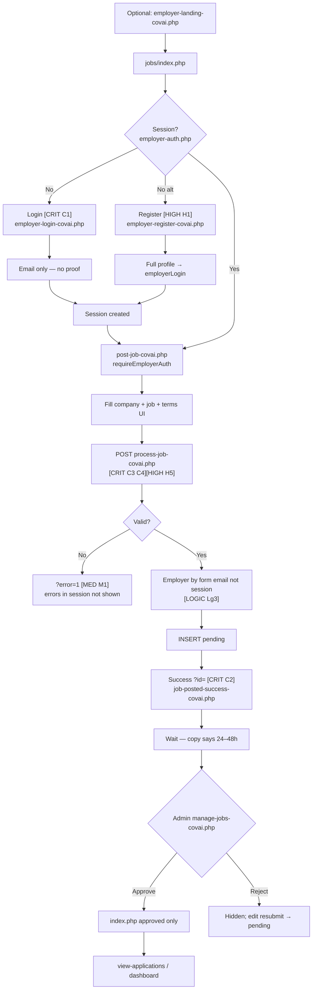


---

## 4) Sequence Diagram: Submit New Job

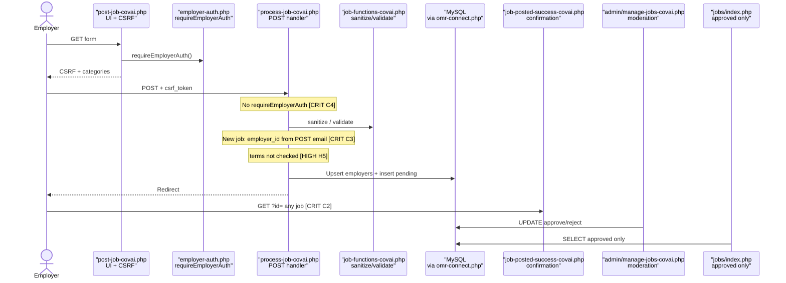


---

## 5) State Machine: Job Posting Lifecycle

Transitions reference where status is written or read.

```mermaid
stateDiagram-v2
    [*] --> DraftSubmitted: Submit form<br/>jobs/process-job-covai.php
    DraftSubmitted --> Pending: INSERT pending<br/>jobs/process-job-covai.php
    Pending --> Approved: Admin approve<br/>jobs/admin/manage-jobs-covai.php
    Pending --> Rejected: Admin reject<br/>jobs/admin/manage-jobs-covai.php
    Approved --> Closed: **Unverified** — no UI writer found in jobs/
    Rejected --> Pending: edit-job-covai.php → process-job-covai.php
    Closed --> [*]
    note right of Approved: Public: index + detail<br/>detail fallback may show non-approved [MED M5]
    note right of Pending: Employer status pending/verified/suspended<br/>separate from job status [LOGIC Lg6]
```


---

## 6) Data Model View (Current Core Tables)

Schema lives in MySQL; **writes/reads** go through the PHP files below.

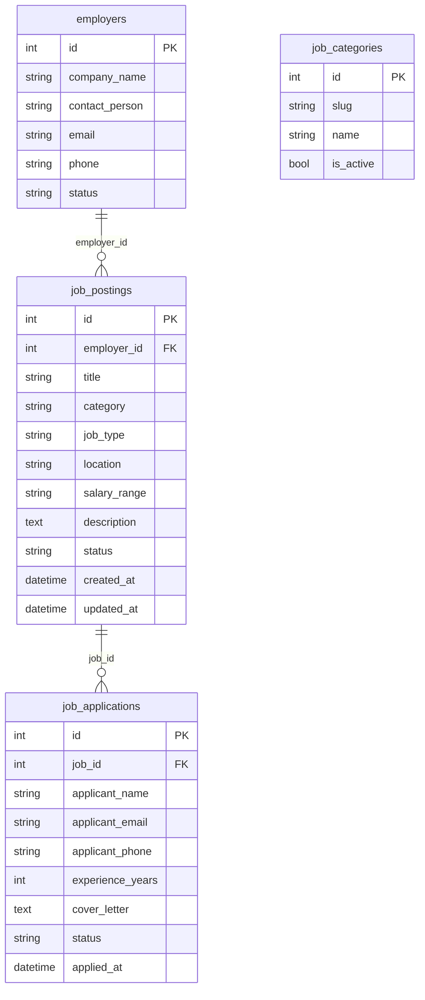

**Note:** `job_postings` also has `applications_count`, `featured`, `requirements`, `benefits`, `application_deadline`, `slug` (per live schema — confirm in DB summary).


| Table              | Typical writers                                                                                     | Typical readers                                                                                                                     |
| ------------------ | --------------------------------------------------------------------------------------------------- | ----------------------------------------------------------------------------------------------------------------------------------- |
| `employers`        | `jobs/process-job-covai.php`, `jobs/employer-register-covai.php`, `jobs/includes/employer-auth.php` | `jobs/my-posted-jobs-covai.php`, `jobs/edit-job-covai.php`, `jobs/admin/manage-jobs-covai.php`                                      |
| `job_postings`     | `jobs/process-job-covai.php`, `jobs/admin/manage-jobs-covai.php`                                    | `jobs/index.php`, `jobs/job-detail-covai.php`, `jobs/my-posted-jobs-covai.php`, `jobs/edit-job-covai.php`                           |
| `job_applications` | `jobs/process-application-covai.php`, `jobs/update-application-status-covai.php`                    | `jobs/view-applications-covai.php`, `jobs/employer-dashboard-covai.php`, `jobs/includes/job-functions-covai.php` (`hasUserApplied`) |


---

## 7) Data Flow Diagram (DFD-style)

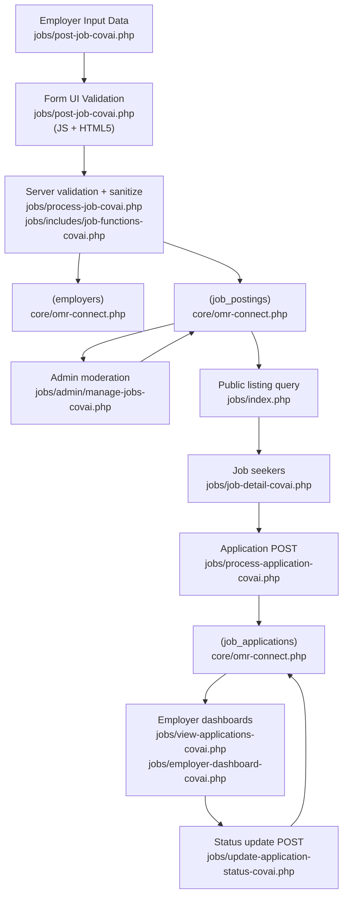


---

## 8) Current Authentication and Authorization Map

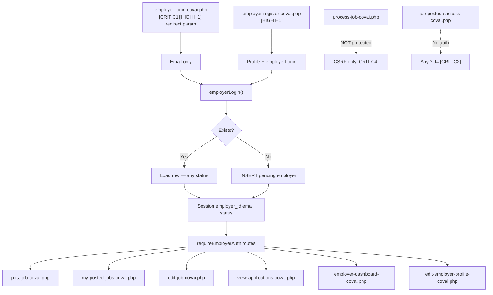


---

## 9) Admin Moderation Flow (Current)

Two parallel admin pipelines — **jobs** vs **employers**.

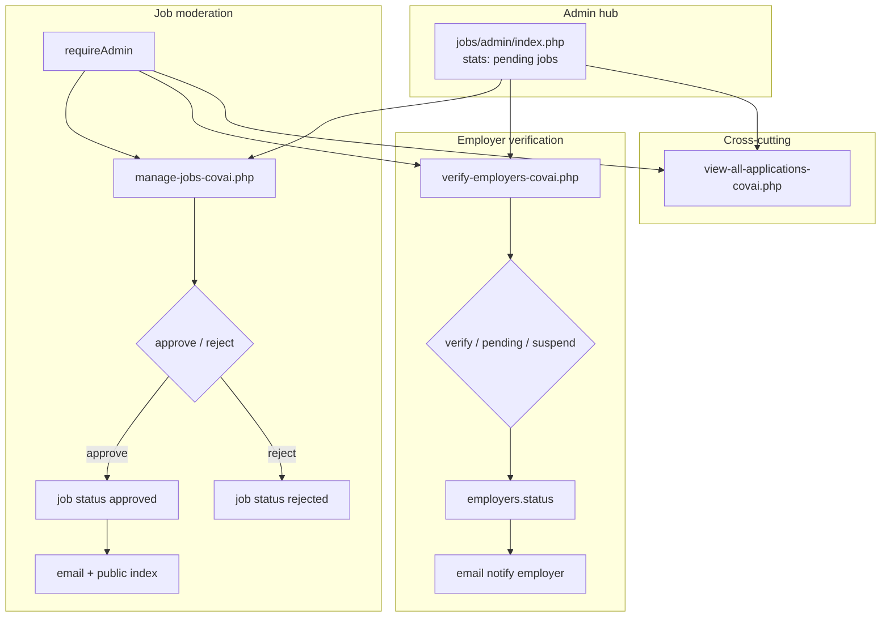

**[LOGIC Lg6]:** Job `approved` does not require employer `verified`; suspended employers may still have session and post unless blocked elsewhere (not enforced on `post-job-covai.php`).


---

## 10) Risk Hotspot Diagram (Security + logic)

```mermaid
flowchart TD
    R1["C1 Email-only login<br/>employer-auth.php"]:::critical --> R5[Account takeover]
    R2["C2 Success ?id=<br/>job-posted-success-covai.php"]:::critical --> R6[Job + employer PII leak]
    R3["C3+C4 process-job<br/>email employer + no auth gate"]:::critical --> R7[Wrong employer / forged POST]
    R4["C5+H3+H4 status update SQL"]:::critical --> R8[CSRF + bad status values]
    R5b["H1 redirect login+register"]:::high --> R9[Open redirect]
    R6b["H2 apply POST no CSRF"]:::high --> R10[Spam applications]
    R7b["H5 terms not server-side"]:::high --> R11[Compliance gap]
    R8b["H6 applicant cookie /"]:::high --> R12[Privacy scope]
    R9b["M1 form errors hidden"]:::medium --> R13[Opaque UX]
    R10b["M2 job_type case mismatch"]:::medium --> R14[Filters empty]
    R11b["M5 detail fallback"]:::medium --> R15[Non-approved visible]
    R12b["L3 index SQL pagination"]:::fixed --> R16[FIXED covai_jobs_index_fetch]

    classDef critical fill:#ffebee,stroke:#d32f2f,stroke-width:2px
    classDef high fill:#fff3e0,stroke:#ef6c00,stroke-width:2px
    classDef medium fill:#fffde7,stroke:#f9a825,stroke-width:2px
    classDef fixed fill:#e8f5e9,stroke:#2e7d32,stroke-width:2px
```


---

## 11) Existing Page-to-Page Navigation Map

Clean URLs: `/jobs/{title-slug}-{id}` → `job-detail-covai.php` (`.htaccess`). Legacy `*-omr.php` → 301 to `*-covai.php`.

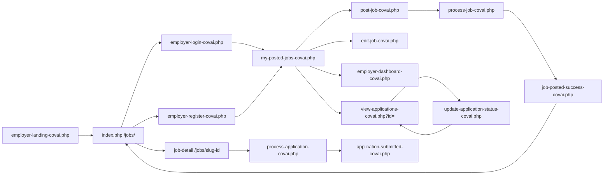


---

## 12) Node Inventory for Step-by-Step Revamp


| #   | Node                   | Primary files to touch                                                                                                                                    |
| --- | ---------------------- | --------------------------------------------------------------------------------------------------------------------------------------------------------- |
| 1   | Auth                   | `jobs/includes/employer-auth.php`, `jobs/employer-login-covai.php`, `jobs/employer-register-covai.php`                                                    |
| 2   | Form                   | `jobs/post-job-covai.php`, `jobs/edit-job-covai.php`                                                                                                      |
| 3   | Submission             | `jobs/process-job-covai.php`, `jobs/includes/job-functions-covai.php`                                                                                     |
| 4   | Success / confirmation | `jobs/job-posted-success-covai.php`                                                                                                                       |
| 5   | Employer dashboard     | `jobs/my-posted-jobs-covai.php`                                                                                                                           |
| 6   | Application management | `jobs/view-applications-covai.php`, `jobs/update-application-status-covai.php`, `jobs/employer-dashboard-covai.php`, `jobs/process-application-covai.php` |
| 7   | Admin job moderation   | `jobs/admin/manage-jobs-covai.php`, `jobs/admin/index.php`                                                                                                |
| 7b  | Admin employer verify  | `jobs/admin/verify-employers-covai.php`                                                                                                                     |
| 7c  | Admin all applications | `jobs/admin/view-all-applications-covai.php`                                                                                                                |
| 8   | Public listing + SEO   | `jobs/index.php`, `jobs/job-detail-covai.php`, `jobs/generate-sitemap.php`, `.htaccess`, `jobs/includes/seo-helper.php`                                  |
| 8b  | Candidate confirmation | `jobs/application-submitted-covai.php`                                                                                                                      |
| 9   | Observability          | `jobs/includes/error-reporting.php`, `components/analytics.php`, `jobs/assets/job-analytics-events.js`                                                    |
| 10  | Security hardening     | C1–C5, H1–H4: auth, `process-job-covai.php`, `update-application-status-covai.php`, redirects, apply CSRF                                                 |
| 11  | Content / rebrand      | Asset renames, `core/mycovai-config.php`, retire OMR landings — §16                                                                                         |


---

## 13) Project Analyst Review (Flaws, Gaps, Recommendations)

*Role: product / delivery analyst — assessment of the **current** job posting system as implemented in this repo.*

### 13.1 Executive summary

The portal delivers a **credible employer journey** (post → pending → admin approve → public listing) and a **separate candidate apply path** with duplicate checks and employer notifications. Under the surface, **authentication is not production-grade**, several **security and consistency gaps** exist, and **UX/error handling** is incomplete for employers. The highest ROI fixes are: **real employer proof**, **CSRF on state-changing endpoints**, **aligned validation and filters**, and **surfacing server errors on the post form**.

---

### 13.2 What is working well (baseline strengths)


| Area                | Observation                                                                                                                                                                                 |
| ------------------- | ------------------------------------------------------------------------------------------------------------------------------------------------------------------------------------------- |
| Moderation pipeline | New jobs default to `pending`; admin can approve/reject in `jobs/admin/manage-jobs-covai.php`.                                                                                              |
| Public listing gate | `jobs/index.php` and listing helpers focus on `approved` jobs.                                                                                                                              |
| Apply flow          | `jobs/process-application-covai.php` validates job exists, requires `approved` status, blocks duplicates via `hasUserApplied()`, increments `applications_count`, sends best-effort emails. |
| Prepared statements | Core inserts/updates in `process-job-covai.php` and `process-application-covai.php` use prepared statements for main writes.                                                                |
| CSRF (partial)      | Job post/edit pipeline uses CSRF in `jobs/post-job-covai.php` → `jobs/process-job-covai.php`.                                                                                               |
| Admin tooling       | Admin job management includes CSRF for approve/reject in `jobs/admin/manage-jobs-covai.php`.                                                                                                |


---

### 13.3 Critical flaws (fix before scaling trust or traffic)


| ID  | Flaw                                                                       | Impact                                                                                                                                                                                       | Evidence / location                                                                                  |
| --- | -------------------------------------------------------------------------- | -------------------------------------------------------------------------------------------------------------------------------------------------------------------------------------------- | ---------------------------------------------------------------------------------------------------- |
| C1  | **Email-only employer “login”** — no password, OTP, or magic-link proof    | Anyone who knows an employer email can impersonate them, edit jobs, and read applications.                                                                                                   | `jobs/includes/employer-auth.php` (`employerLogin`), `jobs/employer-login-covai.php`                 |
| C2  | **Success page exposes job details by numeric `id` without session check** | Information disclosure / ID enumeration (job + company + contact context).                                                                                                                   | `jobs/job-posted-success-covai.php`                                                                  |
| C3  | **Employer identity vs form email on new posts**                           | Session can be tied to one `employer_id` while form submits another email — `process-job-covai.php` resolves employer by posted email, risking **wrong employer linkage** or confusing data. | `jobs/process-job-covai.php` (employer lookup by email vs `$_SESSION['employer_id']` on insert path) |
| C4  | **`process-job-covai.php` bypasses `requireEmployerAuth()`**               | Form is protected; processor is not. A crafted POST with valid CSRF (or session fixation) can create jobs without an employer session on the processor path.                                  | `jobs/process-job-covai.php` (no `employer-auth.php` gate) vs `jobs/post-job-covai.php` line 14       |
| C5  | **Unsafe SQL on application status update**                                | Verify/update queries concatenate IDs and escaped status instead of prepared statements — pattern risk and harder to audit.                                                                  | `jobs/update-application-status-covai.php` lines 25–33                                                |


---

### 13.4 High-severity gaps (security & integrity)


| ID  | Gap                                                  | Impact                                                                                       | Evidence / location                                                     |
| --- | ---------------------------------------------------- | -------------------------------------------------------------------------------------------- | ----------------------------------------------------------------------- |
| H1  | **Open redirect** via `redirect` query on login/register | Phishing / token theft if combined with other issues.                                    | `jobs/employer-login-covai.php`, `jobs/employer-register-covai.php`       |
| H2  | **No CSRF on job application POST**                  | Cross-site application submission / abuse.                                                   | `jobs/job-detail-covai.php` form → `jobs/process-application-covai.php` |
| H3  | **No CSRF on `update-application-status-covai.php`** | Forged status updates if employer session is fixed another way.                              | `jobs/update-application-status-covai.php`                              |
| H4  | **Arbitrary `status` string** on application update  | Data integrity / workflow breakage (typos become permanent states).                          | `jobs/update-application-status-covai.php`                              |
| H5  | **Terms checkbox not enforced server-side**          | Legal/compliance mismatch with on-page copy.                                                 | `jobs/post-job-covai.php` vs `jobs/process-job-covai.php`               |
| H6  | **Applicant tracking cookie**                        | `applicant_email` cookie set on apply — privacy concern; scope and flags should be reviewed. | `jobs/process-application-covai.php` (`setcookie`)                      |


---

### 13.5 Medium-severity gaps (product, UX, consistency)


| ID  | Gap                                                 | Impact                                                                                                                                                                                                                                                                                 | Evidence / location                                                            |
| --- | --------------------------------------------------- | -------------------------------------------------------------------------------------------------------------------------------------------------------------------------------------------------------------------------------------------------------------------------------------- | ------------------------------------------------------------------------------ |
| M1  | **Server validation errors not shown on post form** | `process-job-covai.php` stores `$_SESSION['job_form_errors']` and `job_form_data`, but `**post-job-covai.php` does not read them** — users may see `?error=1` with no explanation.                                                                                                     | `jobs/process-job-covai.php` vs `jobs/post-job-covai.php`                      |
| M2  | **Job type filter mismatch**                        | Filter uses `full-time`, `part-time`, … while stored values appear as `Full-time`, `Part-time`, … — **filters likely never match**.                                                                                                                                                    | `jobs/index.php` (filter options) vs `jobs/post-job-covai.php` (option values) |
| M3  | **Mixed query styles**                              | Some pages use prepared statements; others concatenate SQL (dashboards, edit fallbacks). Harder to audit and higher risk of subtle bugs.                                                                                                                                               | e.g. `jobs/my-posted-jobs-covai.php`, `jobs/edit-job-covai.php`                |
| M4  | **Dual “post job” entry points**                    | Legacy `listings/post-job-omr.php` (OMR copy) posts to missing `listings/process-listing.php` — **broken legacy form**, not the Covai portal flow.                                                                                                                                   | `listings/post-job-omr.php`                                                    |
| M5  | **Job detail may show non-approved jobs**           | Fallback query loads any job by id when not approved — policy for “preview” vs public SEO should be explicit.                                                                                                                                                                          | `jobs/job-detail-covai.php` lines 71–82                                        |
| M6  | **Employer verification disconnected from posting** | Admin can suspend employers; `post-job-covai.php` does not check `employer_status` / suspended.                                                                                                                                                                                      | `jobs/admin/verify-employers-covai.php` vs `jobs/post-job-covai.php`           |
| M7  | **Email promise vs implementation**                 | Copy mentions approval emails; delivery depends on `core/email.php` and server config — needs verification and failure handling.                                                                                                                                                     | Success copy + `jobs/admin/manage-jobs-covai.php`                              |


---

### 13.6 Low-severity / quality issues


| ID  | Issue                                                                                                                    | Notes                                                                                                                                                                      |
| --- | ------------------------------------------------------------------------------------------------------------------------ | -------------------------------------------------------------------------------------------------------------------------------------------------------------------------- |
| L1  | Phone validation **UI vs backend**                                                                                       | `jobs/post-job-covai.php` allows formatted input; `validatePhone()` in `jobs/includes/job-functions-covai.php` is strict — users can pass the browser and fail the server. |
| L2  | Verbose **error_log** in listing helpers                                                                                 | `jobs/includes/job-functions-covai.php` may flood logs in production under load.                                                                                           |
| L3  | **Pagination / filter** on public index                                                                                                                                                  | **FIXED (v4):** `jobs/index.php` uses `covai_jobs_index_fetch()` — SQL pagination. Residual: `getJobListings()` in `job-functions-covai.php` still has in-memory paths if called elsewhere. |


---

### 13.7 Operational & governance gaps


| Area           | Gap                                                                                                                                             |
| -------------- | ----------------------------------------------------------------------------------------------------------------------------------------------- |
| SLAs           | No in-app SLA tracking for “24–48h review”; relies on manual admin discipline.                                                                  |
| Audit          | Admin actions log to `admin_audit_log` in moderation — good — but employer-side edits and application status changes are not uniformly audited. |
| Abuse          | No rate limiting on login, post, or apply endpoints (spam / scraping risk).                                                                     |
| Content policy | No automated signals for scam jobs (links, repeated postings, employer reputation).                                                             |


---

### 13.8 Recommended remediation order (delivery view)

1. **Employer auth proof** (OTP or magic link) — C1.
2. **`requireEmployerAuth()` on `process-job-covai.php`** + bind new jobs to `$_SESSION['employer_id']` only — C3, C4.
3. **Secure success page** (session + ownership or one-time token) — C2.
4. **Prepared statements + CSRF on status update**; whitelist statuses — C5, H3, H4.
5. **Server-side terms + render `job_form_errors` / `job_form_data` on post form** — H5, M1.
6. **CSRF on apply** — H2.
7. **Normalize `job_type` values** (single canonical case in DB + filters) — M2.
8. **Block posting for suspended employers**; align copy with verification — M6.
9. **Retire or redirect legacy `listings/post-job-omr.php`** — M4.
10. **Content rebrand pass** (assets, logo, OMR landings) — §16.
11. **Harden redirects and cookies** — H1, H6.

---

### 13.9 Traceability matrix (finding → primary files)


| Finding IDs | Primary files                                                                                   |
| ----------- | ----------------------------------------------------------------------------------------------- |
| C1, H1      | `jobs/includes/employer-auth.php`, `jobs/employer-login-covai.php`, `jobs/employer-register-covai.php` |
| C2          | `jobs/job-posted-success-covai.php`                                                                  |
| C3, C4, H5, M1 | `jobs/process-job-covai.php`, `jobs/post-job-covai.php`                                           |
| C5, H3, H4  | `jobs/update-application-status-covai.php`, `jobs/view-applications-covai.php`                       |
| H2          | `jobs/job-detail-covai.php`, `jobs/process-application-covai.php`                                    |
| H6          | `jobs/process-application-covai.php`                                                                   |
| M2          | `jobs/index.php`, `jobs/post-job-covai.php`, `jobs/edit-job-covai.php`                               |
| M3          | `jobs/my-posted-jobs-covai.php`, `jobs/edit-job-covai.php`, `jobs/employer-dashboard-covai.php`      |
| M4          | `listings/post-job-omr.php`                                                                            |
| M5          | `jobs/job-detail-covai.php`                                                                            |
| M6          | `jobs/admin/verify-employers-covai.php`, `jobs/post-job-covai.php`                                     |
| L3          | `jobs/index.php`, `jobs/includes/job-functions-covai.php` (`covai_jobs_index_fetch`)                  |

### 13.10 Diagram ↔ finding index

| Section | Node / topic | Finding IDs |
| ------- | ------------ | ----------- |
| §2 | Login/Register | C1, H1 |
| §2 | Process job | C3, C4, H5 |
| §2 | Success | C2 |
| §2 | Public index | FIXED L3 |
| §2 | Detail / apply | H2, M5 |
| §2 | Status update | C5, H3, H4 |
| §2 | Verify employers | M6 |
| §3 | S10 errors | M1 |
| §3 | S11 employer resolve | C3, Lg3 |
| §5 | Closed state | Unverified |
| §8 | process-job unprotected | C4 |
| §8 | success no auth | C2 |
| §9 | Employer verify split | M6 |
| §10 | Full risk map | C1–C5, H1–H6, M1–M2, M5, L3 |
| §16 | OMR branding | X1–X8 |
| §18 | Logic table | Lg1–Lg12 |
| §19 | E2E flows | Per-role checklists |

---

## 14) Suggested Step-by-Step Update Workflow

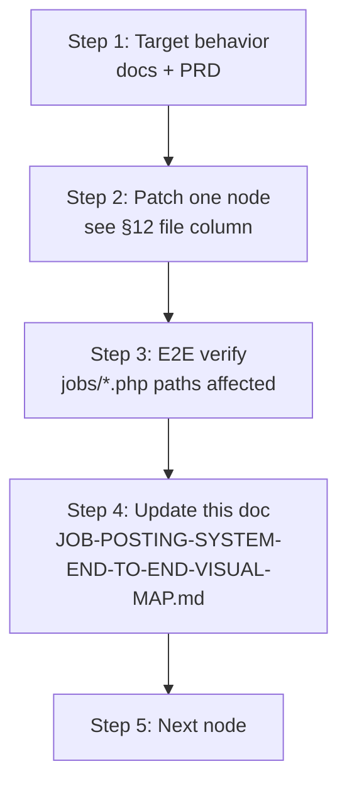


---

## 16) Content & branding mismatch audit

*Copy, labels, and region signals that disagree with **MyCovai / Coimbatore** positioning.*

| ID | Area | Expected (Covai) | Actual in codebase | Severity | Action |
| --- | ---- | ---------------- | ------------------- | -------- | ------ |
| X1 | DB/bootstrap | `mycovai` connection naming | `core/omr-connect.php` used everywhere | Low | Rename or alias when safe; document in LEARNINGS |
| X2 | CSS assets | Covai-named stylesheets | `job-listings-omr.css`, `omr-jobs-unified-design.css` linked on most job pages | Medium | Rename + 301 or bulk find-replace paths |
| X3 | OG / Twitter image | Covai brand asset | `https://mycovai.in/My-OMR-Logo.jpg` on index, post-job, landings | Medium | Replace with Covai logo path |
| X4 | Landing template | Coimbatore canonical | `jobs/includes/landing-page-template.php` breadcrumb/OG still reference `jobs-in-omr-chennai.php` | High | Point to Covai hub URL (`/jobs/` or Coimbatore landing) |
| X5 | Legacy listings form | Coimbatore post job | `listings/post-job-omr.php` — title “Post a Job Vacancy in **OMR**”, MyOMR meta, broken `process-listing.php` | High | 301 to `jobs/employer-landing-covai.php` or remove |
| X6 | Root SEO landings | Coimbatore locality pages | `jobs-in-*-omr.php` at repo root (Kelambakkam, Perungudi, etc.) still OMR/Chennai | Medium | Migrate content to Covai templates or noindex + redirect |
| X7 | Marketing claims | Verifiable stats | “Reach **1000+** qualified candidates” on post-job — not tied to live count | Medium | Use `homepage-listing-counts` or remove hard number |
| X8 | Success / detail display | Human-readable category | Success page shows `category` **slug** not `category_name` from join | Low | Join `job_categories` on success page |

**Section copy consistency (employer-facing)**

| Page | Section | Copy issue |
| ---- | ------- | ---------- |
| `job-posted-success-covai.php` | Timeline | “24–48 hours” — no in-app SLA tracking (§13.7) |
| `employer-login-covai.php` | Security | No mention that email-only login is temporary / insecure |
| `post-job-covai.php` | Terms | Links `/terms-and-conditions.php` — confirm page exists and mentions job listings |
| `application-submitted-covai.php` | PII in URL | `?applicant=` name in query string — minor privacy leak in logs/referrers |

---

## 17) Sections, categories & taxonomy audit

### 17.1 Page sections (information architecture)

| Zone | Primary pages | Purpose | Gap |
| ---- | ------------- | ------- | --- |
| Public discovery | `jobs/index.php` | Search, filters, pagination | `salary_min` / `salary_max` in GET but **not applied** in `covai_jobs_index_fetch()` — dead filters |
| Job detail | `job-detail-covai.php` | Description, apply form, schema | Fallback shows pending jobs; apply form may show on non-approved |
| Employer acquisition | `employer-landing-covai.php`, login, register | Convert employers | Landing not linked from all nav paths — verify `main-nav.php` |
| Employer ops | `my-posted-jobs-covai.php`, `employer-dashboard-covai.php` | Two dashboards — overlapping purpose | Consolidate UX: “jobs” vs “applications” story unclear |
| Admin | `admin/index.php`, manage-jobs, verify-employers, view-all-applications | Operations | Good split; employer verify missing from older docs (now in §9) |

### 17.2 Job categories (`job_categories`)

| Aspect | Implementation | Issue |
| ------ | -------------- | ----- |
| Source | `getJobCategories()` → `job_categories` table, `is_active` filter with fallback | Empty table = empty post form |
| Stored value | `job_postings.category` = **slug** | Correct |
| Display | Join `c.name AS category_name` on index/detail | Success page omits join (X8) |
| Filter | Index filter `?category={slug}` | Aligned with post form |

**Recommendation:** Seed categories in DB; admin UI to manage slugs; validate slug exists on `process-job-covai.php`.

### 17.3 Job type taxonomy

| Layer | Values | Match? |
| ----- | ------ | ------ |
| Post / edit form | `Full-time`, `Part-time`, `Contract`, `Internship` | Canonical store |
| Index filter `<select>` | `full-time`, `part-time`, `contract`, `internship` (lowercase, hyphenated) | **No — M2** |
| Card display | `ucfirst(str_replace('-', ' ', …))` | Masks mismatch in UI counts |

**Canonical plan:** Store lowercase slug in DB (`full-time`) OR map filter values to stored Title Case in SQL.

### 17.4 Application status taxonomy

| UI (`view-applications-covai.php`) | Allowed in processor | Gap |
| ---------------------------------- | -------------------- | --- |
| `pending`, `reviewed`, `shortlisted`, `rejected` (buttons) | Any string via POST — **H4** | Typos / abuse |
| Admin `view-all-applications-covai.php` | Same badges | No employer ownership check on admin path (admin-only — OK) |

### 17.5 Employer status vs job status (two dimensions)

| Dimension | Values | Enforced on post? |
| --------- | ------ | ----------------- |
| `employers.status` | pending, verified, suspended | **No** — Lg6 |
| `job_postings.status` | pending, approved, rejected, closed (?) | Apply checks `approved`; post always `pending` |

---

## 18) Logic audit (business rules & data integrity)

| ID | Rule (expected) | Actual behavior | Severity |
| --- | --------------- | --------------- | -------- |
| Lg1 | Only authenticated employers create jobs | Form: yes; Processor: **no** (C4) | Critical |
| Lg2 | New job `employer_id` = session employer | New job: resolved by **form email** (C3) | Critical |
| Lg3 | Edit job: ownership check | Update path verifies `employer_id` match | OK |
| Lg4 | Public listing = approved only | `covai_jobs_index_fetch` filters approved | OK |
| Lg5 | Apply only to approved jobs | `process-application-covai.php` checks status | OK |
| Lg6 | Suspended employer cannot post | Not checked on `post-job-covai.php` | High |
| Lg7 | Verified employer required to post | Not required; pending employers can post | Medium (product choice) |
| Lg8 | Duplicate applications | `hasUserApplied()` + DB unique handling | OK |
| Lg9 | CSRF on employer state changes | Job post: yes; apply/status: **no** | High |
| Lg10 | Terms acceptance recorded | Client-only checkbox (H5) | High |
| Lg11 | Rejected job → edit → resubmit | Edit + process update; status transition unclear if re-enters `pending` | Medium — verify UPDATE sets `pending` on resubmit |
| Lg12 | Job `closed` lifecycle | No writer in `jobs/`; state machine aspirational | Low |

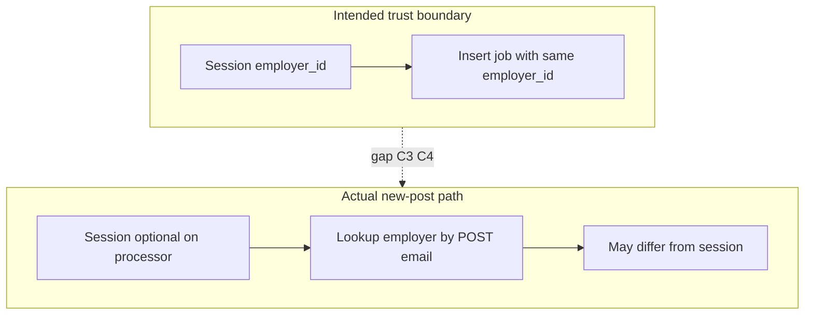

---

## 19) End-to-end user flow audits

### 19.1 Candidate (job seeker) — happy path

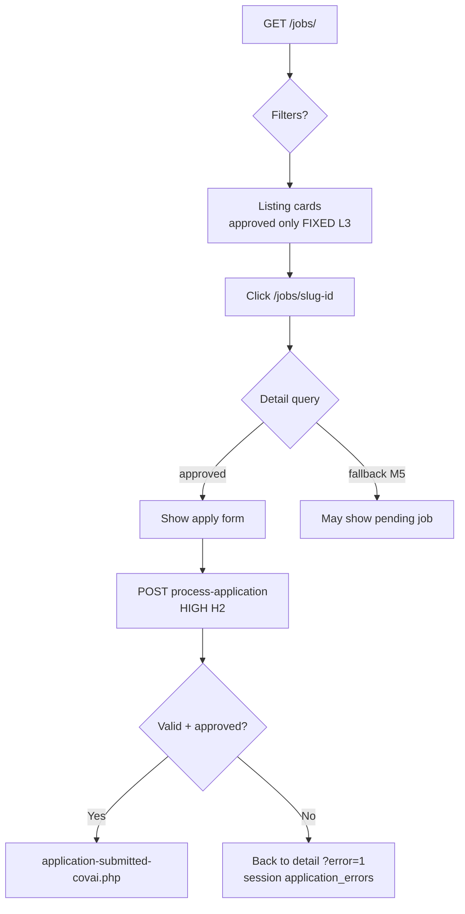

| Step | Pass? | Notes |
| ---- | ----- | ----- |
| Discover jobs | Pass | Pagination works |
| Filter by job type | **Fail** | M2 — zero results likely |
| Filter by category | Pass | If slugs match DB |
| View detail SEO URL | Pass | `.htaccess` rewrite |
| Apply once | Pass | Duplicate blocked |
| Apply without CSRF | **Risk** | H2 |
| Confirmation | Pass | Email best-effort |

### 19.2 Employer — happy path + edge cases

| Step | Pass? | Finding |
| ---- | ----- | ------- |
| Register with profile | Pass | Creates pending employer |
| Login with email only | **Risk** | C1 |
| Post job (authenticated) | Partial | Form OK; processor C3/C4 |
| See validation errors | **Fail** | M1 — `?error=1` without messages |
| Success page | **Risk** | C2 — shareable URL leaks data |
| See job on index before approve | Pass | Not listed |
| Edit rejected job | Pass | Ownership on update |
| View applications | Pass | Per-job view works |
| Mark application reviewed | Partial | Works but H3/H4/C5 |
| Suspended employer posts | **Fail** | Lg6 — should block |

### 19.3 Admin — operations path

| Step | Pass? | Notes |
| ---- | ----- | ----- |
| Open admin hub | Pass | Pending job count |
| Approve/reject job | Pass | CSRF on moderation |
| Verify/suspend employer | Pass | Audit log insert |
| View all applications | Pass | Cross-employer visibility (intended) |
| Employer verify affects posting | **Fail** | Not wired to post-job |

### 19.4 Cross-flow integration matrix

| From → To | Works? | Blocker |
| --------- | ------ | ------- |
| Index → Detail → Apply | Yes | M5 edge case |
| Post → Admin approve → Index | Yes | Email may fail silently |
| Post → Success URL share | Yes | **Should not** — C2 |
| Legacy listings form → Portal | No | M4 broken |
| OMR landing pages → `/jobs/` | Partial | 301 on some `.htaccess` rules only |

---

## 20) Project plan ideas (post-audit roadmap)

Phased delivery aligned with findings — **doc only**; implementation is separate.

### Phase A — Trust & security (2–3 weeks)

- Employer OTP/magic-link auth (C1)
- `requireEmployerAuth()` + session-bound employer on `process-job-covai.php` (C3, C4)
- Success page token or session guard (C2)
- Prepared statements + CSRF + status whitelist on application updates (C5, H2–H4)
- Safe redirect allowlist (H1)

### Phase B — Product correctness (1–2 weeks)

- Normalize `job_type` + fix index filters (M2)
- Surface `job_form_errors` on post-job (M1)
- Block suspended employers; optional “verified only” post (M6)
- Remove detail fallback for non-approved OR employer-only preview mode (M5)
- Wire salary filters or remove from UI (§17.1)

### Phase C — Content & brand (1 week)

- Execute §16 X1–X8
- Retire `listings/post-job-omr.php` (M4)
- Covai locality landings replacing `jobs-in-*-omr.php`

### Phase D — Growth & ops (ongoing)

- Employer SLA dashboard for admins
- Rate limits on login/apply/post
- Category admin UI + seeded taxonomy
- Unified employer dashboard (merge my-jobs + applications)
- Analytics events audit (`job-analytics-events.js`)

### Phase E — SEO & scale

- Sitemap automation in deploy
- Confirm `getJobListings()` callers — deprecate in-memory path
- Structured data QA on approved jobs only

---

## 21) Revision Log (Start Here)

- v1: Baseline visual map generated from current codebase audit.
- v2: Added per-functionality file map, table handlers for ER, file subtext on diagram nodes.
- v3: Project analyst review (§13): flaws, gaps, recommendations, traceability matrix.
- **v4: Convention-level audit** — annotation legend; diagram risk tags; C4/C5; L3 FIXED; M4 path `post-job-omr.php`; employer-verify admin; clean URLs; §16 content mismatches; §17 taxonomy; §18 logic audit; §19 E2E flows; §20 roadmap; §13.10 diagram index.
- Next: Update this file after each remediation PR; link PR/commit in revision log.

---

## Out of scope (this document)

- **No PHP fixes** in this file — blueprint only.
- Legacy **OMR job landing pages** at repo root — footnoted in §16; not fully mapped.
- **`getJobListings()`** in-memory paths — residual note under L3.

