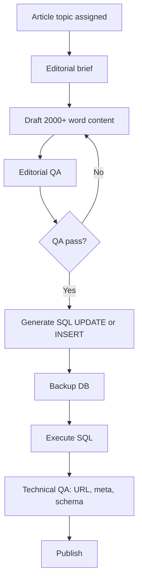

# Long-Form Editorial Workflow (2000+ Words)

- **Last updated:** 2026-03-19
- **Owner:** Editorial Team
- **Applies to:** All news articles in `articles` table, `/local-news/` detail pages
- **Standard:** Every published article must meet the 2000+ word editorial standard

## 1. Overview

All news detail pages must carry robust editorial-style articles: minimum 2,000 words, neutral tone, authoritative and analytical. This workflow covers both **upgrading existing articles** and **publishing new articles**.

## 2. Quality Standard

| Requirement | Detail |
|-------------|--------|
| Word count | ≥ 2,000 words (body only) |
| Tone | Neutral, authoritative, analytical |
| Structure | 5+ H2 sections; see [EDITORIAL-RUBRIC-LONGFORM-NEWS.md](../inbox/EDITORIAL-RUBRIC-LONGFORM-NEWS.md) |
| Evidence | Claims attributed; no unsupported assertions |
| Balance | Multiple viewpoints where applicable |

## 3. Flow

## 4. Upgrading Existing Articles

1. **Audit:** Run `php dev-tools/audit-articles-inventory.php` to regenerate [ARTICLES-EDITORIAL-AUDIT-INVENTORY.md](../inbox/ARTICLES-EDITORIAL-AUDIT-INVENTORY.md).
2. **Plan batches:** Use `database/editorial-upgrades/batch-XX-slugs.txt` to define batches of 5–10 articles.
3. **Draft content:** Write HTML per slug using [LONGFORM-ARTICLE-HTML-TEMPLATE.html](../inbox/LONGFORM-ARTICLE-HTML-TEMPLATE.html) and [EDITORIAL-RUBRIC-LONGFORM-NEWS.md](../inbox/EDITORIAL-RUBRIC-LONGFORM-NEWS.md).
4. **Place files:** Save as `{slug}.html` and `{slug}.summary.txt` in `database/editorial-upgrades/batch-XX/`.
5. **QA:** Run `php dev-tools/qa-editorial-article.php path/to/article.html`.
6. **Generate SQL:** Run `php dev-tools/generate-article-update-sql.php database/editorial-upgrades/batch-XX`.
7. **Backup:** Export `articles` table before executing.
8. **Execute:** Run generated SQL in phpMyAdmin or via CLI.
9. **Validate:** Check `/local-news/{slug}` loads; verify meta and schema.

## 5. New Articles

For new articles, follow [news-publication-workflow.md](news-publication-workflow.md) with these additions:

- **Drafting:** Use the long-form template and rubric. Minimum 2,000 words.
- **QA:** Run `php dev-tools/qa-editorial-article.php` before publication.
- **Insert:** Use SQL INSERT or admin panel; ensure `content` meets word count.

## 6. Key Files

| File | Purpose |
|------|---------|
| [EDITORIAL-RUBRIC-LONGFORM-NEWS.md](../inbox/EDITORIAL-RUBRIC-LONGFORM-NEWS.md) | Rubric, section structure, pre-publish checklist |
| [LONGFORM-ARTICLE-HTML-TEMPLATE.html](../inbox/LONGFORM-ARTICLE-HTML-TEMPLATE.html) | HTML template |
| [ARTICLES-EDITORIAL-AUDIT-INVENTORY.md](../inbox/ARTICLES-EDITORIAL-AUDIT-INVENTORY.md) | Current article inventory and classification |
| [EDITORIAL-QA-CHECKLIST.md](../inbox/EDITORIAL-QA-CHECKLIST.md) | Manual QA checklist |
| [database/editorial-upgrades/README.md](../../database/editorial-upgrades/README.md) | Batch structure and workflow |
| `dev-tools/audit-articles-inventory.php` | Generate inventory from DB or seed |
| `dev-tools/generate-article-update-sql.php` | Generate UPDATE SQL from HTML files |
| `dev-tools/qa-editorial-article.php` | Automated QA (word count, structure) |

## 7. References

- [news-publication-workflow.md](news-publication-workflow.md) — Base publication flow
- [PERUMBAKKAM-ARTICLE-PLAN.md](../content-projects/PERUMBAKKAM-ARTICLE-PLAN.md) — Example editorial plan
